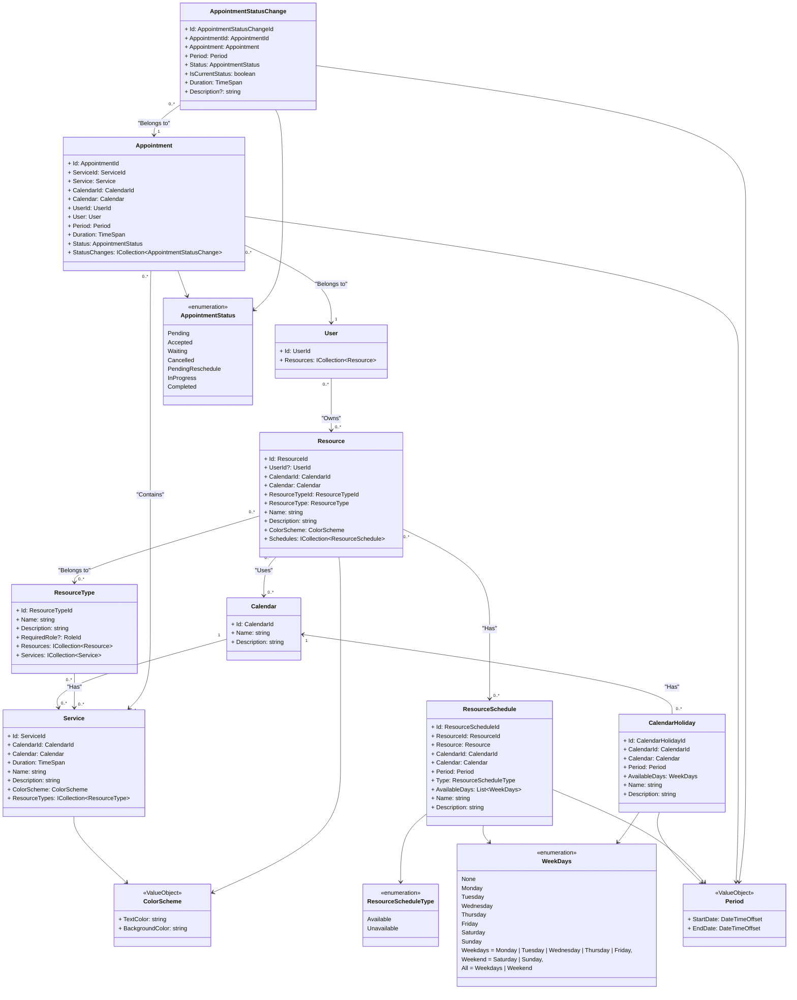

# Notas Agenda

## Descripción Holística del Proyecto "Agenda"

### Visión General

El proyecto "Agenda" es una aplicación de gestión de citas diseñada para facilitar la programación y organización de servicios en una variedad de entornos profesionales. Su objetivo es mejorar la eficiencia en la asignación de recursos, optimizando el tiempo de los profesionales y ofreciendo una experiencia fluida a los usuarios.

### Objetivos del Proyecto

1. **Facilitar la programación de citas**: Permitir a los usuarios reservar citas de manera rápida y sencilla, con la posibilidad de seleccionar servicios y recursos específicos según sus necesidades.

2. **Gestión de recursos y disponibilidad**: Proporcionar una interfaz intuitiva para que los administradores y profesionales puedan gestionar la disponibilidad de los recursos (personal, instalaciones, herramientas, etc.) a través de horarios personalizables y excepciones.

3. **Auditoría y seguimiento de citas**: Implementar un sistema de seguimiento de cambios de estado de las citas, garantizando una trazabilidad completa de cada cita desde su creación hasta su finalización.

4. **Interfaz amigable**: Desarrollar una interfaz que sea accesible y fácil de usar tanto para profesionales como para usuarios finales, asegurando que la programación de citas no sea un proceso complicado.

5. **Integración de roles y permisos**: Crear un sistema robusto de roles y permisos que permita un acceso controlado a diferentes funcionalidades de la aplicación según el tipo de usuario (administrador, profesional, cliente, etc.).

### Público Objetivo

La aplicación está dirigida a diversas industrias y sectores que requieren una gestión eficiente de citas y recursos. Esto incluye, pero no se limita a, profesionales de servicios, consultores, educadores, terapeutas y cualquier organización que necesite coordinar encuentros con sus clientes o usuarios.

### Beneficios Esperados

- **Ahorro de tiempo**: La automatización del proceso de programación de citas reducirá el tiempo dedicado a tareas administrativas, permitiendo a los profesionales enfocarse en su trabajo principal.
- **Mejora en la satisfacción del usuario**: Al facilitar la programación de citas y ofrecer una gestión transparente de la disponibilidad, los usuarios experimentarán un servicio más fluido y eficiente.
- **Optimización de recursos**: La gestión efectiva de los recursos permitirá maximizar su uso y minimizar los tiempos de inactividad, mejorando la rentabilidad de las organizaciones.

### Conclusión

El proyecto "Agenda Manager" se posiciona como una solución integral para la gestión de citas en múltiples contextos profesionales, abordando las necesidades tanto de los proveedores de servicios como de sus clientes. A través de una plataforma intuitiva y funcional, se espera que esta herramienta contribuya a una atención más organizada y eficiente en diversos sectores.

## Diagrama de clases



## Calendar

El `Calendar` representa un conjunto de eventos que se pueden programar en un `Calendar`, cada `Calendar` tendrá sus propios `Resource`, `Service`, `Appointment`, etc.

En `Calendar` comparte todos los `User` del sistema.

Se trata de una agrupación de los `Appointment` creados en el `Calendar`.

## CalendarHoliday

Un `CalendarHoliday` representa rango de días festivos en un `Calendar`, aplicable a todos los `ResourceSchedules` del `Calendar`.

Un `CalendarHoliday` tiene asociado un `Calendar` y un `Period`.

Por lo tanto, representa un rango de días festivos en un `Calendar` aplicable a todos los `ResourceSchedules` del `Calendar`.

## Resources

Un `Resource` representa un recurso que puede ser utilizado por un `Service`.

Un `Resource` tiene asociado un `Calendar` y un `ResourceType`.

Un `Resource` tiene una lista lista de `ResourceSchedule` que representa los horarios en los que el `Resource` está disponible/indisponible.

El `User?` solo se aplica a los recursos que pertenecen a un `User` que lo determina la propiedad `ResourceType.RequiredRole`.

Como funciona, los `ResourceType` son los tipos de recursos que tiene el sistema.

Que es un `Resource`?, es un recurso que puede ser utilizado en un `Service`.

Un `Service` es un servicio (tipo de cita) que se puede crear en la agenda.

Es decir, un `Service` contiene uno o varios `ResourceType` para decir que tipos de recursos necesita para crear la cita.

Por ejemplo podemos crear varios tipos de `ResourceType`

```text
- Name:  "Anestesista" | Description: "Anestesista" | RequiredRole: "Employee"
- Name:  "Cirujano" | Description: "Doctor" | RequiredRole: "Employee"
- Name:  "Enfermera" | Description: "Enfermera" | RequiredRole: "Employee"
- Name:  "Place" | Description: "Un box de cirugía"
- Name:  "Instrumental" | Description: "Instrumental quirúrgico"
```

Luego a partir de hay podemos crear los `Resource`.

Si elijo un `ResourceType` que `RequiredRole` es null, simplemente relleno campos como `Name` y `Description`, etc, pero `UserId` es null.

Si elijo un `ResourceType` que `RequiredRole` es un `RoleId`, entonces el `Resource` debe tener un `UserId` que sea un `User` que tenga ese `RoleId`.

- Un `ResourceSchedule` tiene asociado un `Resource`.
- Un `ResourceSchedule` representa la disponibilidad de un `Resource`.
- Los `ResourceSchedule` tienen dos tipos, `Available` y `Unavailable`.
- Un `ResourceSchedule` tiene asociado un `Period`.
- Un `ResourceSchedule` tienen disponibilidad diaria con `WeekDays`.
- Un `Resource` puede tener uno o varios `ResourceSchedule`.

Por ejemplo, supongamos que tenemos un `Resource` que es un `Anestesista` y queremos que sea disponible de lunes a viernes de 8:00 a 12:00 y de 14:00 a 18:00.

A la vez, queremos que crear una excepción de disponibilidad para el día 11 de Noviembre de 2024 (Martes), por que el `Anestesista` ha pedido un día libre.

Primero creamos 2 `ResourceSchedule` con un `ResourceScheduleType` -> `Available` con un rango de disponibilidad de lunes a viernes de 8:00 a 12:00 y de 14:00 a 18:00 entra las fechas `2020-01-01` y `2040-01-01`.

```text
- Period: 2020-01-01 08:00:00 - 2040-01-01 12:00:00 | AvailableDays: [Monday, Tuesday, Wednesday, Thursday, Friday] | Type: Available
- Period: 2020-01-01 14:00:00 - 2040-01-01 18:00:00 | AvailableDays: [Monday, Tuesday, Wednesday, Thursday, Friday] | Type: Available
```

Con esto estamos diciendo que ue el `Anestesista` está disponible todos los días de lunes a viernes de 8:00 a 12:00 y de 14:00 a 18:00 desde el 1 de enero de 2020 hasta el 1 de enero de 2040.

Ahora vamos a crear una excepción de disponibilidad para el día 11 de Noviembre de 2024 (Martes), por que el `Anestesista` ha pedido un día libre.

```text
- Period: 2024-11-11 00:00:00 - 2024-11-11 23:59:59 | AvailableDays: [Tuesday] | Type: Unavailable
```

Con esto estamos diciendo que ue el `Anestesista` no está disponible el día 11 de Noviembre de 2024 (Martes).

Los `ResourceScheduleType` -> `Unavailable` tienen prioridad sobre los `ResourceScheduleType` -> `Available`.

## Services

- Un `Service` son **servicios** e indica los `ResourceType[]` necesarios para realizar el `Service`.
- Un `Service` tiene asociado un `Calendar`.

Para ver su comportamiento, ver [`Resources`](./#resources)

## Appointments

- Un `Appointment` representa una cita programada en un `Calendar`.
- Un `Appointment` tiene asociado un `Service`.
- Un `Appointment` tiene un `AppointmentStatus` que representa el estado de la cita por defecto `Pending`.
- Un `AppointmentStatusChange` tiene asociado un `Appointment` y es un registro de auditoría de los cambios de estado de un `Appointment`.
- Un `AppointmentStatusChange` representa el cambio de estado de un `Appointment`.

Para la creación de un `Appointment` se debe tener en cuenta que el tipo de cita que se quiere crear, para ello usamos el `Service`.

El `Service` es el **contrato** que define los `ResourceType[]` que se necesitan para realizar el `Service` (crear una cita).

Por ejemplo, si queremos crear una cita de tipo **Extracción de diente**, se obtendra el servicio correspondiente para saber que `ResourceType[]` se necesitan para realizar el servicio.

Imaginemos que el servicio de **Extracción de diente** necesita los siguientes `ResourceType[]`:

- Anestesista
- Cirujano
- Enfermera
- Box de cirugía
- Instrumental quirúrgico X

Se obtendrán los `Resource[]` que tengan los `ResourceType` que se necesitan para realizar el servicio.

Cuando se crea un `Appointment` por defecto el estado es `Pending` y se indica tanto en el `Appointment` como en el `AppointmentStatusChange`.

En el `Appointment` se indica el estado `Pending` en la propiedad `Status: AppointmentStatus`.
En el `AppointmentStatusChange` se indica el estado `Pending` en la propiedad `Status: AppointmentStatus`, así como la fecha y hora de creación.

Un `AppointmentStatusChange` tiene un `Period` que representa el periodo de tiempo en el que el estado si inicio y finalizo, pero siempre el estado actual se sabe cuando `Period.StartDate` y `Period.EndDate` son iguales y la propiedad `IsCurrentStatus` de `AppointmentStatusChange` es `true` y la propiedad `Duration` sera `default(TimeSpan)` - `00:00:00`.

Cada vez que se cambia el estado de un `Appointment` se cambia al nuevo estado de `Appointment.Status`, se cierra el `AppointmentStatusChange` actual con `Period.EndDate` del momento de cierre, se calcula el `Duration` y se crea un nuevo `AppointmentStatusChange` con el estado actual y el periodo de tiempo actual.

```text
Agregados y sus Entidades:
└── Appointment (AR)
    └── AppointmentStatusChange (E)
└── AuditRecord (AR)
└── Calendar (AR)
    └── CalendarHoliday (E)
└── Resource (AR)
    └── ResourceSchedule (E)
└── ResourceType (AR)
└── Service (AR)
└── User (AR)
    ├── Role (E)
    ├── Permission (E)
    └── UserToken (E)
```

---

Relaciones entre `ResourceType`, `Resource` y `Service`:

```csharp
public sealed class Resource : AggregateRoot
{
    public ResourceId Id { get; } = null!;

    public ResourceTypeId TypeId { get; private set; } = null!;

    public ResourceType Type { get; private set; } = null!;

    // ...
}

public sealed class ResourceType : AggregateRoot
{
    public ResourceTypeId Id { get; private set; } = null!;

    public string Name { get; private set; } = default!;

    public string Description { get; private set; } = default!;

    public bool RequiredRole { get; private set; }

    public IReadOnlyList<Resource> Resources => _resources.AsReadOnly();

    public IReadOnlyList<Service> Services => _services.AsReadOnly();

    // ...
}

public sealed class Service : AggregateRoot
{
    public ServiceId Id { get; } = null!;

    private readonly List<ResourceType> _resourceTypes = [];

    public IReadOnlyCollection<ResourceType> ResourceTypes => _resourceTypes.AsReadOnly();
}
```

- La relación entre `ResourceType` y `Resource` es de uno a muchos.
- La relación entre `ResourceType` y `Service` es de muchos a muchos.

La responsabilidad de `ResourceType` es la de crear tipos de recursos como `Cirujano`, `Anestesista`  `Enfermería` o `Odontología`.

Cada `Resource` tiene un `ResourceType` que representa el tipo de recurso que es.

Por ejemplo un `Resource` puede ser algo como:

Estos podrían ser recursos, entre otros:

- **Name**: Dr. Pedro Pérez
- **Description**: Doctor de cabecera
- **ResourceType**: Cirujano
- **ResourceRole**: Employee (Entidad predefinida de `Role`)

- **Name**: Laura García
- **Description**: Enfermera de cabecera
- **ResourceType**: Enfermería
- **ResourceRole**: Employee (Entidad predefinida de `Role`)

- **Name**: Ana López
- **Description**: Anestesista de cabecera
- **ResourceType**: Anestesista
- **ResourceRole**: Employee (Entidad predefinida de `Role`)

- **Name**: Box 1
- **Description**: Box de cirugía 1
- **ResourceType**: Facility

- **Name**: "Algún instrumento"
- **Description**: Instrumento quirúrgico
- **ResourceType**: Equipment

Para crear un servicio:

- **Name**: Extracción de muela
- **Description**: Extracción de muela
- **ResourceType**: [Cirujano, Anestesista, Enfermería, Box 1, Algún instrumento]
- **Duración**: 1 hora

---

Creación de una cita:

- ¿Que servicio se va a realizar?
  - Extracción de muela
    - ¿Qué recursos necesitas?
      - ¿Qué recursos están disponibles que cumplan con los requisitos?
        - Cirujano
          - Obtener todos los cirujanos
        - Anestesista
          - Obtener todos los anestesistas
        - Enfermería
          - Obtener todas las enfermeras
        - Box 1
          - Obtener todos los boxes
        - Algún instrumento
          - Obtener todos los instrumentos

---

Lo dejo por si acaso.

Ahora que recuerdo, una de las cosas que pensé, es que los recursos se pueden clasificar en tres categorías:

```csharp
public enum ResourceCategory
{
    Staff,    // Personal, personas (con RoleId)
    Facility    // Boxes, salas
    Equipment,  // Instrumentos, máquinas
}
```

Por ejemplo, saquemos a pasear a **Sangre de Merlos** y a **El chocolate loco**

- **Name**: El chocolate loco (yo que se esos apodos Sevillanos)
- **Description**: El mas sumbao
- **ResourceType**: Cochero
- **Role**: Employee (Entidad predefinida de `Role`)
- **ResourceCategory**: Staff

- **Name**: Sangre de Merlos (el caballo vamos :P)
- **Description**: Caballo manso marron y de caballo largo.
- **ResourceType**: Caballo
- **ResourceCategory**: Equipment (me sabe mal, pero es lo que hay)

- **Name**: Carruaje de caballos
- **Description**: Para 4 personas tirado de un caballo
- **ResourceType**: Carruaje
- **ResourceCategory**: Equipment
