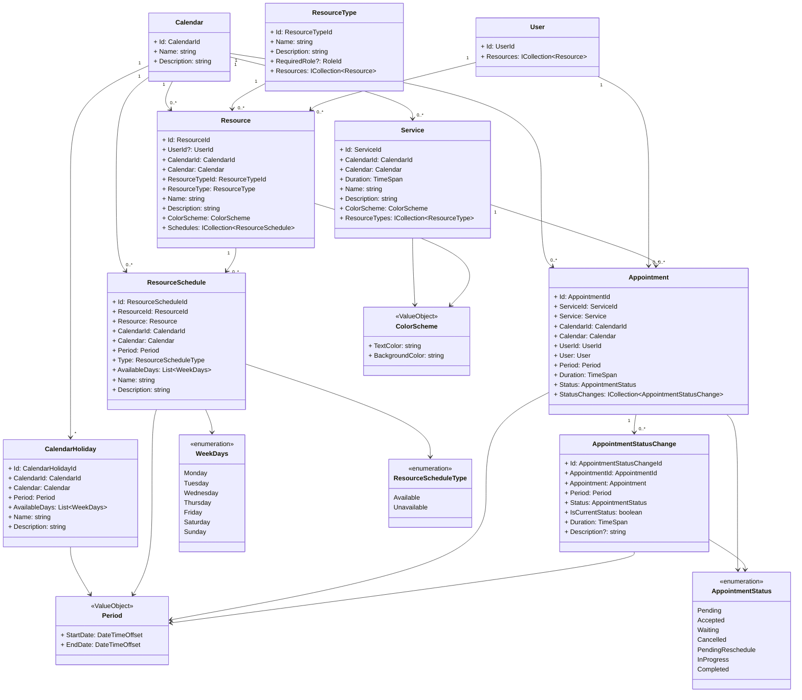

# Notas Agenda

## Diagrama de clases



### Descripción de las Relaciones

1. **Calendar - CalendarHoliday (1 a muchos):** Cada calendario puede tener múltiples días festivos (`CalendarHoliday`), y cada día festivo pertenece a un único calendario.

2. **Calendar - Resource (1 a muchos):** Cada recurso (`Resource`) está asociado a un solo calendario (`Calendar`), mientras que un calendario puede tener múltiples recursos asignados.

3. **ResourceType - Resource (1 a muchos):** Cada recurso tiene un tipo (`ResourceType`), y un tipo de recurso puede ser compartido entre varios recursos.

4. **User - Resource (1 a muchos):** Un usuario (`User`) puede tener múltiples recursos asignados a él, pero cada recurso puede pertenecer a un solo usuario.

5. **Calendar - ResourceSchedule (1 a muchos):** Un calendario puede tener múltiples horarios de recursos (`ResourceSchedule`), y cada horario pertenece a un solo calendario.

6. **Resource - ResourceSchedule (1 a muchos):** Cada recurso puede tener múltiples horarios (`ResourceSchedule`), mientras que un horario está asociado a un solo recurso.

7. **Calendar - Service (1 a muchos):** Un calendario puede tener varios servicios (`Service`), mientras que cada servicio está vinculado a un solo calendario.

8. **Service - Appointment (1 a muchos):** Un servicio puede estar asociado a múltiples citas (`Appointment`), y cada cita está vinculada a un solo servicio.

9. **Calendar - Appointment (1 a muchos):** Un calendario puede tener varias citas (`Appointment`), y cada cita está asignada a un único calendario.

10. **User - Appointment (1 a muchos):** Un usuario puede tener múltiples citas, pero cada cita está asociada a un solo usuario.

11. **Appointment - AppointmentStatusChange (1 a muchos):** Una cita puede tener múltiples cambios de estado (`AppointmentStatusChange`), mientras que cada cambio de estado pertenece a una sola cita.

12. **Appointment - AppointmentStatus (1 a 1):** Cada cita tiene un estado (`AppointmentStatus`) que indica el estado actual de la cita.

13. **AppointmentStatusChange - AppointmentStatus (1 a 1):** Cada cambio de estado de una cita (`AppointmentStatusChange`) está vinculado a un estado específico.

## Agenda

El `Calendar` representa un conjunto de eventos que se pueden programar en un `Calendar`, cada `Calendar` tendrá sus propios `Resource`, `Service`, `Appointment`, etc.

En `Calendar` comparte todos los `User` del sistema.

Se trata de una agrupación de los `Appointment` creados en el `Calendar`.

Un `CalendarHoliday` representa rango de días festivos en un `Calendar`, aplicable a todos los `ResourceSchedules` del `Calendar`.

Un `CalendarHoliday` tiene asociado un `Calendar` y un `Period`.

Por lo tanto, representa un rango de días festivos en un `Calendar` aplicable a todos los `ResourceSchedules` del `Calendar`.

## Resources

Un `Resource` representa un recurso que puede ser utilizado en un `Service`.

Un `Resource` tiene asociado un `Calendar` y un `ResourceType`.

Un `Resource` tiene una lista lista de `ResourceSchedule` que representa los horarios en los que el `Resource` está disponible/indisponible.

El `User?` solo se aplica a los recursos que pertenecen a un `User` que lo determina la propiedad `ResourceType.RequiredRole`.

Como funciona, los `ResourceType` son los tipos de recursos que tiene el sistema.

Que es un `Resource`?, es un recurso que puede ser utilizado en un `Service`.

Un `Service` es un servicio (tipo de cita) que se puede crear en la agenda.

Es decir, un `Service` contiene uno o varios `ResourceType` para decir que tipos de recursos necesita para crear la cita.

Por ejemplo podemos crear varios tipos de `ResourceType`

```text
- Name:  "Anestesista" | Description: "Anestesista" | RequiredRole: "Employee"
- Name:  "Cirujano" | Description: "Doctor" | RequiredRole: "Employee"
- Name:  "Enfermera" | Description: "Enfermera" | RequiredRole: "Employee"
- Name:  "Place" | Description: "Un box de cirugía"
- Name:  "Instrumental" | Description: "Instrumental quirúrgico"
```

Luego a partir de hay podemos crear los `Resource`.

Si elijo un `ResourceType` que `RequiredRole` es null, simplemente relleno campos como `Name` y `Description`, etc, pero `UserId` es null.

Si elijo un `ResourceType` que `RequiredRole` es un `RoleId`, entonces el `Resource` debe tener un `UserId` que sea un `User` que tenga ese `RoleId`.

* Un `ResourceSchedule` tiene asociado un `Resource`.
* Un `ResourceSchedule` representa la disponibilidad de un `Resource`.
* Los `ResourceSchedule` tienen dos tipos, `Available` y `Unavailable`.
* Un `ResourceSchedule` tiene asociado un `Period`.
* Un `ResourceSchedule` tienen disponibilidad diaria con `WeekDays`.
* Un `Resource` puede tener uno o varios `ResourceSchedule`.

Por ejemplo, supongamos que tenemos un `Resource` que es un `Anestesista` y queremos que sea disponible de lunes a viernes de 8:00 a 12:00 y de 14:00 a 18:00.

A la vez, queremos que crear una excepción de disponibilidad para el día 11 de Noviembre de 2024 (Martes), por que el `Anestesista` ha pedido un día libre.

Primero creamos 2 `ResourceSchedule` con un `ResourceScheduleType` -> `Available` con un rango de disponibilidad de lunes a viernes de 8:00 a 12:00 y de 14:00 a 18:00 entra las fechas `2020-01-01` y `2040-01-01`.

```text
- Period: 2020-01-01 08:00:00 - 2040-01-01 12:00:00 | AvailableDays: [Monday, Tuesday, Wednesday, Thursday, Friday] | Type: Available
- Period: 2020-01-01 14:00:00 - 2040-01-01 18:00:00 | AvailableDays: [Monday, Tuesday, Wednesday, Thursday, Friday] | Type: Available
```

Con esto estamos diciendo que ue el `Anestesista` está disponible todos los días de lunes a viernes de 8:00 a 12:00 y de 14:00 a 18:00 desde el 1 de enero de 2020 hasta el 1 de enero de 2040.

Ahora vamos a crear una excepción de disponibilidad para el día 11 de Noviembre de 2024 (Martes), por que el `Anestesista` ha pedido un día libre.

```text
- Period: 2024-11-11 00:00:00 - 2024-11-11 23:59:59 | AvailableDays: [Tuesday] | Type: Unavailable
```

Con esto estamos diciendo que ue el `Anestesista` no está disponible el día 11 de Noviembre de 2024 (Martes).

Los `ResourceScheduleType` -> `Unavailable` tienen prioridad sobre los `ResourceScheduleType` -> `Available`.

## Services

* Un `Service` son **servicios** e indica los `ResourceType[]` necesarios para realizar el `Service`.
* Un `Service` tiene asociado un `Calendar`.

Para ver su comportamiento, ver [`Resources`](./#resources)

## Appointments

* Un `Appointment` representa una cita programada en un `Calendar`.
* Un `Appointment` tiene asociado un `Service`.
* Un `Appointment` tiene un `AppointmentStatus` que representa el estado de la cita por defecto `Pending`.
* Un `AppointmentStatusChange` tiene asociado un `Appointment` y es un registro de auditoría de los cambios de estado de un `Appointment`.
* Un `AppointmentStatusChange` representa el cambio de estado de un `Appointment`.

Para la creación de un `Appointment` se debe tener en cuenta que el tipo de cita que se quiere crear, para ello usamos el `Service`.

El `Service` es el **contrato** que define los `ResourceType[]` que se necesitan para realizar el `Service` (crear una cita).

Por ejemplo, si queremos crear una cita de tipo **Extracción de diente**, se obtendra el servicio correspondiente para saber que `ResourceType[]` se necesitan para realizar el servicio.

Imaginemos que el servicio de **Extracción de diente** necesita los siguientes `ResourceType[]`:

* Anestesista
* Cirujano
* Enfermera
* Box de cirugía
* Instrumental quirúrgico X

Se obtendrán los `Resource[]` que tengan los `ResourceType` que se necesitan para realizar el servicio.

Cuando se crea un `Appointment` por defecto el estado es `Pending` y se indica tanto en el `Appointment` como en el `AppointmentStatusChange`.

En el `Appointment` se indica el estado `Pending` en la propiedad `Status: AppointmentStatus`.
En el `AppointmentStatusChange` se indica el estado `Pending` en la propiedad `Status: AppointmentStatus`, así como la fecha y hora de creación.

Un `AppointmentStatusChange` tiene un `Period` que representa el periodo de tiempo en el que el estado si inicio y finalizo, pero siempre el estado actual se sabe cuando `Period.StartDate` y `Period.EndDate` son iguales y la propiedad `IsCurrentStatus` de `AppointmentStatusChange` es `true` y la propiedad `Duration` sera `default(TimeSpan)` - `00:00:00`.

Cada vez que se cambia el estado de un `Appointment` se cambia al nuevo estado de `Appointment.Status`, se cierra el `AppointmentStatusChange` actual con `Period.EndDate` del momento de cierre, se calcula el `Duration` y se crea un nuevo `AppointmentStatusChange` con el estado actual y el periodo de tiempo actual.
