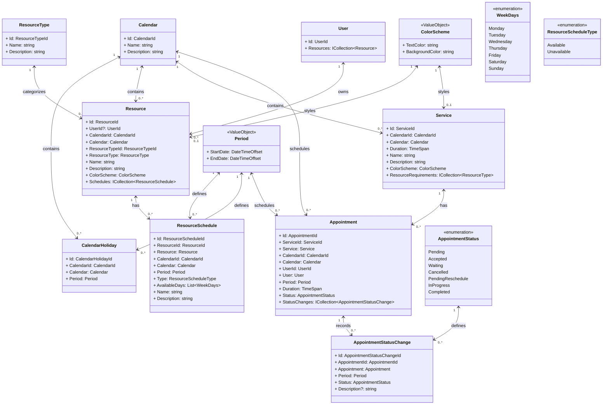

# Notas

## Herramientas

<https://mermaid.js.org/syntax/classDiagram.html>

## Descripción del proyecto

Crear una Agenda para gestión de citas.

Se necesita gestionar los `Appointment` de los `User` en un `Calendar`.

Se debe de contar con unos `Resource` y tipos de recursos `Resource.ResourceType` para poder gestionar los recursos de la agenda.

`Resource.ResourceType` puede ser (Person, Place, Equipment), si es `Person` deberá tener una relación con un `User`.

Los `Resource` deberán tener uno o varios `ResourceSchedule` con el tiempo de disponibilidad en un rango de `StartDate` y `EndDate`.

Los `ResourceSchedule.ResourceScheduleType` tendrá uno valor de `Available` o `Unavailable` que se aplica a un rango de `Period` y los días de la semana que se aplican `Service.AvailableDays` [Monday, Tuesday, Wednesday, Thursday, Friday, Saturday, Sunday]

Las `ResourceSchedule.ResourceScheduleType` de tipo `Unavailable` tendrán precedencia a los de tipo `Available`.

Un `Service` indicará los `Resource[]` y el `Period` necesario para poder crear un `Appointment`.

Los `Appointment` deberán tener seguimiento del estado de la cita tipo (Pending, Accepted, Waiting, Canceled, PendingReschedule, InProgress, Completed) y se vera su estado en `Appointment.AppointmentStatus`.

Un `Appointment` tendrá una relación con `AppointmentStatusChange` se tendrá el historial de los cambios de estado de la cita.

`CalendarHoliday` Determina días festivos que no se podrán programar citas, precedencia mas alta que los `ResourceSchedule`.

## Domain Model

### Calendars

* El `Calendar` representa un conjunto de eventos que se pueden programar en un `Calendar`, cada `Calendar` tendrá sus propios `Resource`, `Service`, etc.
* En `Calendar` comparte todos los `User` del sistema.

### CalendarHolidays

* Un `CalendarHoliday` representa un día festivo en un `Calendar`, aplicable a todos los `ResourceSchedules` del `Calendar`.

### Resources

* Un `Resource` representa un recurso que puede ser utilizado en un `Service`.
* Los `Resource` pueden ser de diferentes tipos, como `User`, `Box`, `Instrumental`.

### ResourceSchedules

* Un `ResourceSchedule` tiene asociado un `Resource`.
* Un `ResourceSchedule` representa la disponibilidad de un `Resource`.
* Los `ResourceSchedule` tienen dos tipos, `Available` y `Unavailable`.
* Un `ResourceSchedule` tiene asociado un `Period`.
* Un `ResourceSchedule` tienes disponibilidad diaria con `WeekDays`.
* Un `Resource` puede tener uno o varios `ResourceSchedule`.

### Services

* Un `Service` son **servicios** e indica los `Resource[]` necesarios para realizar el `Service`.
* Un `Service` tiene asociado un `Calendar`.

### Appointments

* Un `Appointment` representa una cita programada en un `Calendar`.
* Un `Appointment` tiene asociado un `Service`.
* Un `Appointment` tiene un `AppointmentStatus` que representa el estado de la cita.

### AppointmentStatusChange

* Un `AppointmentStatusChange` tiene asociado un `Appointment` y es un registro de auditoría de los cambios de estado de un `Appointment`.
* Un `AppointmentStatusChange` representa el cambio de estado de un `Appointment`.

### Users

* Un `User` representa un usuario del sistema que puede ser asignado a un `Resource` en un `Calendar` o un `Customer`.
* El tipo de `User` se define en el `Role`.

## Types

Algunos de los **Enums** o **ValueObjects** que se utilizan en el sistema.

* `ResourceType` **Enum** de los tipos de `Resource` (`User`, `Box`, `Instrumental`).
* `Period` **ValueObject** que representa un periodo de tiempo (`StartDate`, `EndDate`).
* `AppointmentStatus` **Enum** de los estados de un `Appointment` (`Pending`, `Accepted`, `Waiting`, `Cancelled`, `PendingReschedule`, `InProgress` `Completed`).
* `WeekDays` **Enum** de los días de la semana (`Monday`, `Tuesday`, `Wednesday`, `Thursday`, `Friday`, `Saturday`, `Sunday`).

## Diagrama de clases

### Descripción de las Relaciones

* `Calendar` - `CalendarHoliday`: Un `Calendar` contiene varios `CalendarHoliday`, que representan los días festivos asociados al calendario.
* `Calendar` - `Resource`: Un `Calendar` es utilizado por múltiples `Resource` para programar su disponibilidad o sus horarios.
* `Calendar` - `ResourceSchedule`: Un `Calendar` puede contener varios `ResourceSchedule`, que representan los horarios de disponibilidad o indisponibilidad de los recursos.
* `Calendar` - `Service`: Un `Service` puede estar asociado a un `Calendar` que coordina su programación de citas.
* `Calendar` - `Appointment`: Un Appointment puede estar vinculado a un `Calendar`, que establece el contexto temporal para dicha cita.
* `Resource` - `ResourceType`: Un `Resource` se clasifica mediante un `ResourceType`, que define el tipo de recurso (por ejemplo, **Persona**, **Place** o **Instrumental**).
* `Resource` - `ResourceSchedule`: Un `Resource` tiene múltiples `ResourceSchedule` que indican sus horarios de disponibilidad o excepciones.
* `Resource` - `User`: Opcionalmente, un `Resource` puede estar asociado a un User si es de tipo **Persona**.
* `Service` - `ResourceType`: Un `Service` requiere varios `ResourceType`, especificando los tipos de recursos necesarios para realizar el servicio.
* `Appointment` - `Service`: Una Appointment está basada en un `Service`, que define los requisitos de recursos y la duración.
* `Appointment` - `AppointmentStatusChange`: Una `Appointment` puede tener múltiples `AppointmentStatusChange` que documentan los cambios de estado.
* `Appointment` - `Calendar`: Cada Appointment está asociada a un `Calendar` que organiza su horario.
* `Appointment` - `User`: Una Appointment está vinculada al User que la creó.
* `Period` - `ResourceSchedule / CalendarHoliday / Appointment`: El `Period` representa el rango de tiempo y es utilizado en `ResourceSchedule`, `CalendarHoliday`, y `Appointment`.
* `ColorScheme` - `Resource / Service`: ColorScheme se utiliza opcionalmente para definir el estilo visual de `Resource` y `Service`.
* `AppointmentStatusChange` - `AppointmentStatus`: Cada `AppointmentStatusChange` captura un estado específico definido por `AppointmentStatus`.

---
