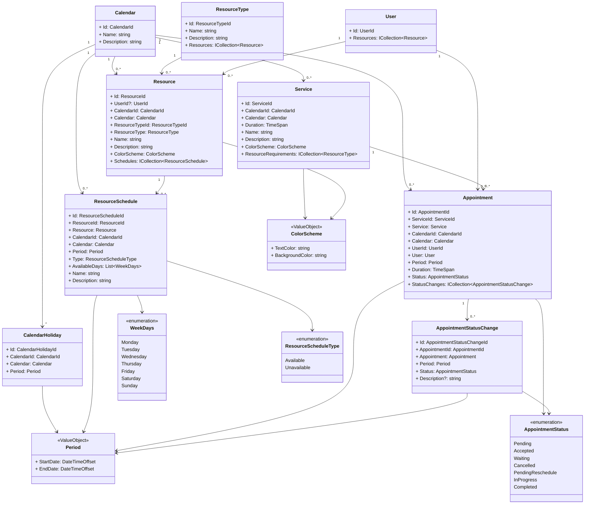

# Notas

## Herramientas

<https://mermaid.js.org/syntax/classDiagram.html>

## Descripción del proyecto

Crear una Agenda para gestión de citas.

Se necesita gestionar los `Appointment` de los `User` en un `Calendar`.

Se debe de contar con unos `Resource` y tipos de recursos `Resource.ResourceType` para poder gestionar los recursos de la agenda.

`Resource.ResourceType` puede ser (Person, Place, Equipment), si es `Person` deberá tener una relación con un `User`.

Los `Resource` deberán tener uno o varios `ResourceSchedule` con el tiempo de disponibilidad en un rango de `StartDate` y `EndDate`.

Los `ResourceSchedule.ResourceScheduleType` tendrá uno valor de `Available` o `Unavailable` que se aplica a un rango de `Period` y los días de la semana que se aplican `Service.AvailableDays` [Monday, Tuesday, Wednesday, Thursday, Friday, Saturday, Sunday]

Las `ResourceSchedule.ResourceScheduleType` de tipo `Unavailable` tendrán precedencia a los de tipo `Available`.

Un `Service` indicará los `Resource[]` y el `Period` necesario para poder crear un `Appointment`.

Los `Appointment` deberán tener seguimiento del estado de la cita tipo (Pending, Accepted, Waiting, Canceled, PendingReschedule, InProgress, Completed) y se vera su estado en `Appointment.AppointmentStatus`.

Un `Appointment` tendrá una relación con `AppointmentStatusChange` se tendrá el historial de los cambios de estado de la cita.

`CalendarHoliday` Determina días festivos que no se podrán programar citas, precedencia mas alta que los `ResourceSchedule`.

## Domain Model

### Calendars

* El `Calendar` representa un conjunto de eventos que se pueden programar en un `Calendar`, cada `Calendar` tendrá sus propios `Resource`, `Service`, etc.
* En `Calendar` comparte todos los `User` del sistema.

### CalendarHolidays

* Un `CalendarHoliday` representa un día festivo en un `Calendar`, aplicable a todos los `ResourceSchedules` del `Calendar`.

### Resources

* Un `Resource` representa un recurso que puede ser utilizado en un `Service`.
* Los `Resource` pueden ser de diferentes tipos, como `User`, `Box`, `Instrumental`.

### ResourceSchedules

* Un `ResourceSchedule` tiene asociado un `Resource`.
* Un `ResourceSchedule` representa la disponibilidad de un `Resource`.
* Los `ResourceSchedule` tienen dos tipos, `Available` y `Unavailable`.
* Un `ResourceSchedule` tiene asociado un `Period`.
* Un `ResourceSchedule` tienes disponibilidad diaria con `WeekDays`.
* Un `Resource` puede tener uno o varios `ResourceSchedule`.

### Services

* Un `Service` son **servicios** e indica los `Resource[]` necesarios para realizar el `Service`.
* Un `Service` tiene asociado un `Calendar`.

### Appointments

* Un `Appointment` representa una cita programada en un `Calendar`.
* Un `Appointment` tiene asociado un `Service`.
* Un `Appointment` tiene un `AppointmentStatus` que representa el estado de la cita.

### AppointmentStatusChange

* Un `AppointmentStatusChange` tiene asociado un `Appointment` y es un registro de auditoría de los cambios de estado de un `Appointment`.
* Un `AppointmentStatusChange` representa el cambio de estado de un `Appointment`.

### Users

* Un `User` representa un usuario del sistema que puede ser asignado a un `Resource` en un `Calendar` o un `Customer`.
* El tipo de `User` se define en el `Role`.

## Types

Algunos de los **Enums** o **ValueObjects** que se utilizan en el sistema.

* `ResourceType` **Enum** de los tipos de `Resource` (`User`, `Box`, `Instrumental`).
* `Period` **ValueObject** que representa un periodo de tiempo (`StartDate`, `EndDate`).
* `AppointmentStatus` **Enum** de los estados de un `Appointment` (`Pending`, `Accepted`, `Waiting`, `Cancelled`, `PendingReschedule`, `InProgress` `Completed`).
* `WeekDays` **Enum** de los días de la semana (`Monday`, `Tuesday`, `Wednesday`, `Thursday`, `Friday`, `Saturday`, `Sunday`).

## Diagrama de clases

### Descripción de las Relaciones

1. **Calendar - CalendarHoliday (1 a muchos):** Cada calendario puede tener múltiples días festivos (`CalendarHoliday`), y cada día festivo pertenece a un único calendario.

2. **Calendar - Resource (1 a muchos):** Cada recurso (`Resource`) está asociado a un solo calendario (`Calendar`), mientras que un calendario puede tener múltiples recursos asignados.

3. **ResourceType - Resource (1 a muchos):** Cada recurso tiene un tipo (`ResourceType`), y un tipo de recurso puede ser compartido entre varios recursos.

4. **User - Resource (1 a muchos):** Un usuario (`User`) puede tener múltiples recursos asignados a él, pero cada recurso puede pertenecer a un solo usuario.

5. **Calendar - ResourceSchedule (1 a muchos):** Un calendario puede tener múltiples horarios de recursos (`ResourceSchedule`), y cada horario pertenece a un solo calendario.

6. **Resource - ResourceSchedule (1 a muchos):** Cada recurso puede tener múltiples horarios (`ResourceSchedule`), mientras que un horario está asociado a un solo recurso.

7. **Calendar - Service (1 a muchos):** Un calendario puede tener varios servicios (`Service`), mientras que cada servicio está vinculado a un solo calendario.

8. **Service - Appointment (1 a muchos):** Un servicio puede estar asociado a múltiples citas (`Appointment`), y cada cita está vinculada a un solo servicio.

9. **Calendar - Appointment (1 a muchos):** Un calendario puede tener varias citas (`Appointment`), y cada cita está asignada a un único calendario.

10. **User - Appointment (1 a muchos):** Un usuario puede tener múltiples citas, pero cada cita está asociada a un solo usuario.

11. **Appointment - AppointmentStatusChange (1 a muchos):** Una cita puede tener múltiples cambios de estado (`AppointmentStatusChange`), mientras que cada cambio de estado pertenece a una sola cita.

12. **Appointment - AppointmentStatus (1 a 1):** Cada cita tiene un estado (`AppointmentStatus`) que indica el estado actual de la cita.

13. **AppointmentStatusChange - AppointmentStatus (1 a 1):** Cada cambio de estado de una cita (`AppointmentStatusChange`) está vinculado a un estado específico.
