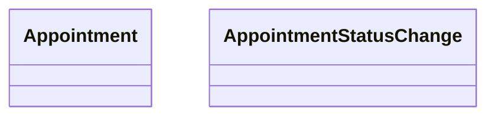

# Appointments

* Un `Appointment` representa una cita programada en un `Calendar`.
* Un `Appointment` tiene asociado un `Service`.
* Un `Appointment` tiene un `AppointmentStatus` que representa el estado de la cita por defecto `Pending`.
* Un `AppointmentStatusChange` tiene asociado un `Appointment` y es un registro de auditoría de los cambios de estado de un `Appointment`.
* Un `AppointmentStatusChange` representa el cambio de estado de un `Appointment`.

Para la creación de un `Appointment` se debe tener en cuenta que el tipo de cita que se quiere crear, para ello usamos el `Service`.

El `Service` es el **contrato** que define los `ResourceType[]` que se necesitan para realizar el `Service` (crear una cita).

Por ejemplo, si queremos crear una cita de tipo **Extracción de diente**, se obtendra el servicio correspondiente para saber que `ResourceType[]` se necesitan para realizar el servicio.

Imaginemos que el servicio de **Extracción de diente** necesita los siguientes `ResourceType[]`:

* Anestesista
* Cirujano
* Enfermera
* Box de cirugía
* Instrumental quirúrgico X

Se obtendrán los `Resource[]` que tengan los `ResourceType` que se necesitan para realizar el servicio.

Cuando se crea un `Appointment` por defecto el estado es `Pending` y se indica tanto en el `Appointment` como en el `AppointmentStatusChange`.

En el `Appointment` se indica el estado `Pending` en la propiedad `Status: AppointmentStatus`.
En el `AppointmentStatusChange` se indica el estado `Pending` en la propiedad `Status: AppointmentStatus`, así como la fecha y hora de creación.

Un `AppointmentStatusChange` tiene un `Period` que representa el periodo de tiempo en el que el estado si inicio y finalizo, pero siempre el estado actual se sabe cuando `Period.StartDate` y `Period.EndDate` son iguales y la propiedad `IsCurrentStatus` de `AppointmentStatusChange` es `true` y la propiedad `Duration` sera `default(TimeSpan)` - `00:00:00`.

Cada vez que se cambia el estado de un `Appointment` se cambia al nuevo estado de `Appointment.Status`, se cierra el `AppointmentStatusChange` actual con `Period.EndDate` del momento de cierre, se calcula el `Duration` y se crea un nuevo `AppointmentStatusChange` con el estado actual y el periodo de tiempo actual.
