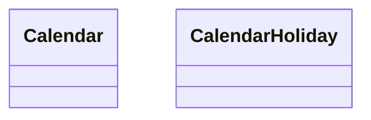

# Calendars

El `Calendar` representa un conjunto de eventos que se pueden programar en un `Calendar`, cada `Calendar` tendrá sus propios `Resource`, `Service`, `Appointment`, etc.

En `Calendar` comparte todos los `User` del sistema.

Se trata de una agrupación de los `Appointment` creados en el `Calendar`.

Un `CalendarHoliday` representa rango de días festivos en un `Calendar`, aplicable a todos los `ResourceSchedules` del `Calendar`.

Un `CalendarHoliday` tiene asociado un `Calendar` y un `Period`.

Por lo tanto, representa un rango de días festivos en un `Calendar` aplicable a todos los `ResourceSchedules` del `Calendar`.
