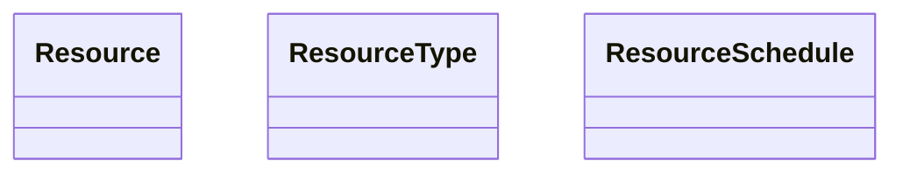

# Resources



Un `Resource` representa un recurso que puede ser utilizado en un `Service`.

Un `Resource` tiene asociado un `Calendar` y un `ResourceType`.

Un `Resource` tiene una lista lista de `ResourceSchedule` que representa los horarios en los que el `Resource` está disponible/indisponible.

El `User?` solo se aplica a los recursos que pertenecen a un `User` que lo determina la propiedad `ResourceType.RequiredRole`.

Como funciona, los `ResourceType` son los tipos de recursos que tiene el sistema.

Que es un `Resource`?, es un recurso que puede ser utilizado en un `Service`.

Un `Service` es un servicio (tipo de cita) que se puede crear en la agenda.

Es decir, un `Service` contiene uno o varios `ResourceType` para decir que tipos de recursos necesita para crear la cita.

Por ejemplo podemos crear varios tipos de `ResourceType`

```text
- Name:  "Anestesista" | Description: "Anestesista" | RequiredRole: "Employee"
- Name:  "Cirujano" | Description: "Doctor" | RequiredRole: "Employee"
- Name:  "Enfermera" | Description: "Enfermera" | RequiredRole: "Employee"
- Name:  "Place" | Description: "Un box de cirugía"
- Name:  "Instrumental" | Description: "Instrumental quirúrgico"
```

Luego a partir de hay podemos crear los `Resource`.

Si elijo un `ResourceType` que `RequiredRole` es null, simplemente relleno campos como `Name` y `Description`, etc, pero `UserId` es null.

Si elijo un `ResourceType` que `RequiredRole` es un `RoleId`, entonces el `Resource` debe tener un `UserId` que sea un `User` que tenga ese `RoleId`.

* Un `ResourceSchedule` tiene asociado un `Resource`.
* Un `ResourceSchedule` representa la disponibilidad de un `Resource`.
* Los `ResourceSchedule` tienen dos tipos, `Available` y `Unavailable`.
* Un `ResourceSchedule` tiene asociado un `Period`.
* Un `ResourceSchedule` tienen disponibilidad diaria con `WeekDays`.
* Un `Resource` puede tener uno o varios `ResourceSchedule`.

Por ejemplo, supongamos que tenemos un `Resource` que es un `Anestesista` y queremos que sea disponible de lunes a viernes de 8:00 a 12:00 y de 14:00 a 18:00.

A la vez, queremos que crear una excepción de disponibilidad para el día 11 de Noviembre de 2024 (Martes), por que el `Anestesista` ha pedido un día libre.

Primero creamos 2 `ResourceSchedule` con un `ResourceScheduleType` -> `Available` con un rango de disponibilidad de lunes a viernes de 8:00 a 12:00 y de 14:00 a 18:00 entra las fechas `2020-01-01` y `2040-01-01`.

```text
- Period: 2020-01-01 08:00:00 - 2040-01-01 12:00:00 | AvailableDays: [Monday, Tuesday, Wednesday, Thursday, Friday] | Type: Available
- Period: 2020-01-01 14:00:00 - 2040-01-01 18:00:00 | AvailableDays: [Monday, Tuesday, Wednesday, Thursday, Friday] | Type: Available
```

Con esto estamos diciendo que ue el `Anestesista` está disponible todos los días de lunes a viernes de 8:00 a 12:00 y de 14:00 a 18:00 desde el 1 de enero de 2020 hasta el 1 de enero de 2040.

Ahora vamos a crear una excepción de disponibilidad para el día 11 de Noviembre de 2024 (Martes), por que el `Anestesista` ha pedido un día libre.

```text
- Period: 2024-11-11 00:00:00 - 2024-11-11 23:59:59 | AvailableDays: [Tuesday] | Type: Unavailable
```

Con esto estamos diciendo que ue el `Anestesista` no está disponible el día 11 de Noviembre de 2024 (Martes).

Los `ResourceScheduleType` -> `Unavailable` tienen prioridad sobre los `ResourceScheduleType` -> `Available`.
