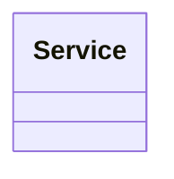

# Services

* Un `Service` son **servicios** e indica los `ResourceType[]` necesarios para realizar el `Service`.
* Un `Service` tiene asociado un `Calendar`.

Para ver su comportamiento, ver [`Resources`](./resources.md)
