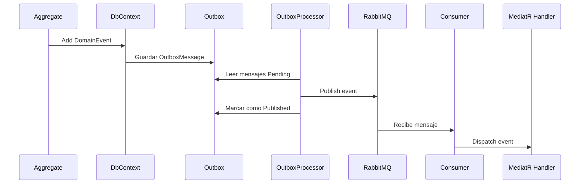

# Event-Driven Architecture - RabbitMQ + Outbox Pattern

## 💡 ¿Qué se ha implementado?

Este sistema utiliza arquitectura orientada a eventos para desacoplar los cambios de dominio de sus efectos secundarios. Se ha incorporado RabbitMQ junto al patrón Transactional Outbox para garantizar entrega fiable de eventos.

### 🔥 Objetivo

Desacoplar el dominio de la infraestructura, ganar resiliencia, trazabilidad y tolerancia a fallos, evitando dependencias directas al publicar eventos.

---

## ⚙️ ¿Cómo funciona?

1. **Un Aggregate lanza un DomainEvent.**
2. **El interceptor de persistencia convierte ese evento en un `OutboxMessage`.**
3. **Se guarda el `OutboxMessage` junto a los cambios de EF Core (en la misma transacción).**
4. **Un HostedService (`OutboxMessageProcessor`) lee periódicamente los mensajes `Pending` y los publica a RabbitMQ.**
5. **El mensaje se marca como `Published`.**
6. **Otro HostedService (`RabbitMqConsumerHostedService`) escucha RabbitMQ y reenvía los eventos a MediatR (via `IntegrationEventDispatcher`).**

---

## 🗃 Estructura del flujo

---

## 📁 Archivos clave

- `OutboxMessage.cs`: Aggregate del mensaje a publicar.
- `OutboxMessageProcessorHostedService`: Publica eventos desde Outbox.
- `RabbitMqConsumerHostedService`: Escucha eventos de Rabbit y los reenvía.
- `IntegrationEventDispatcher`: Usa MediatR para ejecutar los handlers de eventos.
- `RabbitMqClient`: Cliente de publicación a RabbitMQ.
- `PersistDomainEventsToOutboxInterceptor`: Interceptor que guarda los eventos de dominio en Outbox.

---

## ✅ Ejemplo práctico

Cuando un usuario solicita recuperar contraseña:

1. Se lanza `UserTokenCreatedDomainEvent`.
2. Se guarda automáticamente en `OutboxMessages`.
3. El `OutboxMessageProcessor` lo publica en RabbitMQ.
4. `RabbitMqConsumerHostedService` lo recibe y lo despacha a un handler que envía el email.

---

## 🔍 ¿Por qué el patrón Outbox?

- Se asegura de que el evento **solo se publique si el commit del dominio se ha realizado con éxito**.
- **Evita mensajes huérfanos o inconsistencias**.
- Permite añadir lógica de reintentos, fallos, trazabilidad, etc.

---

## 📌 Notas

- Todos los eventos (incluso internos) se pasan por Outbox, no hay short-circuits ni bypass.
- Se puede extender fácilmente para enviar a múltiples sistemas (otro Rabbit, Kafka, Email, etc).
- Permite auditar TODO sin acoplar código.

---

## 🚧 Tests funcionales

- Se incluye test completo del flujo `ForgotPassword → Outbox → Published` para validar todo el circuito.
- Se puede usar `WaitForPublishedOutboxMessage()` en integración para asegurar que el evento fue procesado correctamente.

---

## 📎 Futuras mejoras

- Añadir Dead Letter Queue
- Mejorar reintentos progresivos
- Dashboard de eventos fallidos
