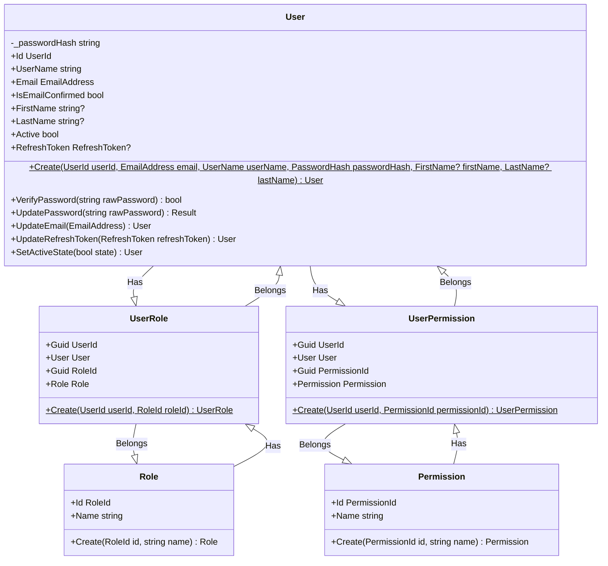
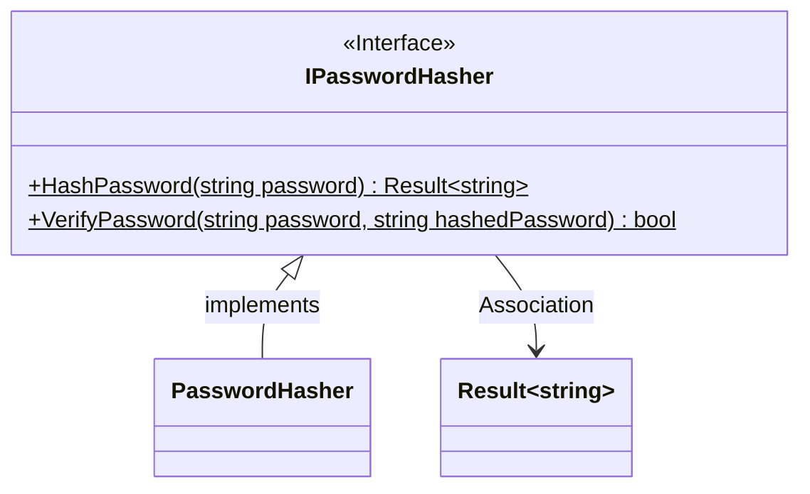
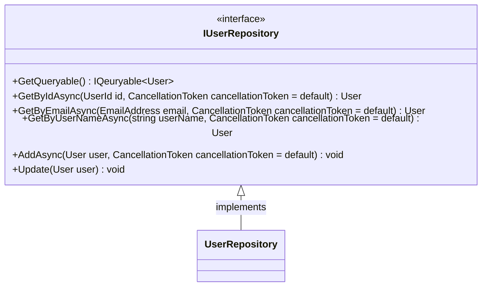

# Identity

## Relaciones User, Role y Permission

- `User` `src/Domain/Users/User.cs`
- `Role` `src/Domain/Authorization/Role.cs`
- `Permission` `src/Domain/Authorization/Permission.cs`
- `UserRole` `src/Domain/Authorization/UserRole.cs`
- `UserPermission` `src/Domain/Authorization/UserPermission.cs`

## Authentication

- `IAuthenticationManager` `src/Application/Common/Interfaces/Users/IAuthenticationManager.cs`
- `AuthenticationManager` `src/Infrastructure/Common/Authentication/AuthenticationManager.cs`

## JwtTokenGenerator

- `IJwtTokenGenerator` `src/Application/Common/Interfaces/Users/IJwtTokenGenerator.cs`
- `JwtTokenGenerator` `src/Infrastructure/Common/Authentication/JwtTokenGenerator.cs`

## CurrentUserProvider

- `ICurrentUserProvider` `src/Application/Common/Interfaces/Users/ICurrentUserProvider.cs`
- `CurrentUserProvider` `src/WebApi/Services/CurrentUserProvider.cs`

## IAuthorizationManager

- `IAuthorizationManager` `src/Domain/Authorization/Persistence/IAuthorizationManager.cs`
- `AuthorizationManager` `src/Infrastructure/Authorization/AuthorizationManager.cs`

- `IPasswordHasher` `src/Domain/Common/Interfaces/IPasswordHasher.cs`
- `PasswordHasher` `src/Infrastructure/Common/Authentication/PasswordHasher.cs`

## Repositories

- `IUsersRepository` `src/Domain/Users/Persistence/IUsersRepository.cs`
- `UserRepository` `src/Infrastructure/Users/UserRepository.cs`
