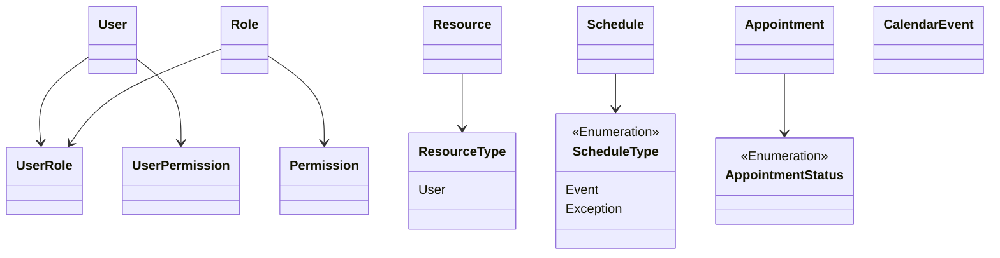

# Entities

## User

## Resource

Recurso disponible.

## ResourceType

Tipo de recurso Doctor, Asistente, Box, etc.

Uno de ellos ha de ser de tipo `User`, un `User` puede ser `Doctor`, `Asistente` o `Box`.

TODO: Buscar un nombre para el tipo de recurso de tipo `User` y que este en la base de datos como inmutable de manera predeterminada.

Los otros tipos de `Resource` deben poder ser dinámicos.

## Schedule

Disponibilidad del recurso.

Eventos de un solo día o un rango de fechas en los días de la semana seleccionados.

- Lunes true
- Martes false
- Miércoles true
- etc

Inicio y fin del rango despoblé.

Ejemplo, todos los Lunes, Miércoles y Jueves entre las 8:00 y 14:00 el `Resource` estará disponible.

## ScheduleType

Tipo de horario evento, exception, etc.

- Schedule
- Exception

## Appointment

Cita o turno.

## AppointmentStatus

Estatus de la cita.

## CalendarEvent

Calendario de eventos, `Resource` necesarios y duración del evento.

Como un contrato de requerimientos y duración para poder realizar la tarea (Limpieza, Extracción, etc).
