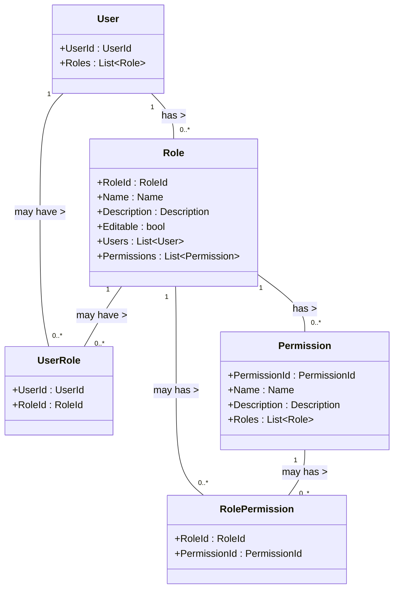

# Authorization

## Descripción

```mermaid
classDiagram
    class User {
        +UserId : UserId
        +Roles : List~Role~
    }

    class Role {
        +RoleId : RoleId
        +Name : Name
        +Description : Description
        +Editable : bool
        +Users : List~User~
        +Permissions : List~Permission~
    }

    class UserRole {
        +UserId : UserId
        +RoleId : RoleId
    }

    class Permission {
        +PermissionId : PermissionId
        +Name : Name
        +Description : Description
        +Roles : List~Role~
    }

    class RolePermission {
        +RoleId : RoleId
        +PermissionId : PermissionId
    }

    User "1" -- "0..*" Role : has >
    Role "1" -- "0..*" Permission : has >
    User "1" -- "0..*" UserRole : may have >
    Role "1" -- "0..*" UserRole : may have >
    Role "1" -- "0..*" RolePermission : may has >
    Permission "1" -- "0..*" RolePermission : may has >
```
