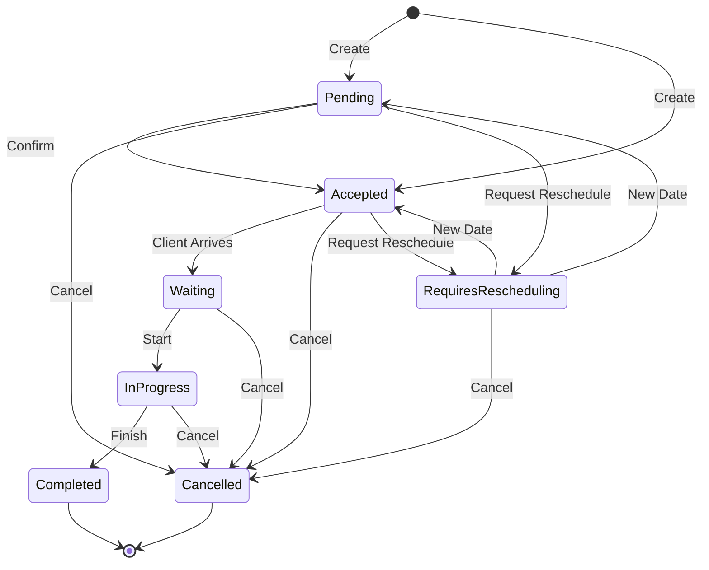

# Appointment

- **Aggregate Root**: `Appointment`
- **Namespace**: `AgendaManager.Domain.Appointments`
- **Tipo**: Entidad de Dominio Sellada (sealed)
- **Herencia**: `AggregateRoot`

- (*) Pendiente de revisión.

## Descripción General

Un `Appointment` representa una cita programada en el sistema que pertenece a un calendario específico. Es la unidad central de reserva que conecta un servicio concreto con un usuario en un período de tiempo determinado. Gestiona todo el ciclo de vida de la cita, incluyendo su programación, estados y finalización, asegurando que se cumplan todas las reglas de negocio y restricciones del calendario asociado.

### Responsabilidades

- Gestionar el ciclo de vida completo de una cita
- Validar la disponibilidad temporal y de recursos
- Mantener la integridad y consistencia del estado de la cita
- Registrar el historial de cambios de estado
- Gestionar el proceso de confirmación cuando sea necesario
- Aplicar las reglas de negocio en creación y modificaciones
- Gestionar las transiciones de estado válidas
- Emitir eventos de dominio para cambios significativos
- Las citas con un estado no final expiradas deben ser canceladas automáticamente

## Propiedades y Estructura

### Propiedades Principales

| Nombre            | Tipo                                      | Descripción                           |
| ----------------- | ----------------------------------------- | ------------------------------------- |
| `Id`              | `AppointmentId`                           | Identificador único de la cita        |
| `ServiceId`       | `ServiceId`                               | Identificador del servicio asociado   |
| `Service`         | `Service`                                 | Servicio asociado a la cita           |
| `CalendarId`      | `CalendarId`                              | Identificador del calendario asociado |
| `Calendar`        | `Calendar`                                | Calendario asociado a la cita         |
| `UserId`          | `UserId`                                  | Identificador del usuario asociado    |
| `User`            | `User`                                    | Usuario asociado a la cita            |
| `Period`          | `Period`                                  | Período de la cita                    |
| `CurrentState`    | `AppointmentCurrentState`                 | Estado actual de la cita              |
| `StatusHistories` | `IReadOnlyList<AppointmentStatusHistory>` | Historial de cambios de estado        |
| `Resources`       | `IReadOnlyList<Resource>`                 | Recursos asignados a la cita          |

### Invariantes

- `Id` no puede ser `null` en ningún momento
- Una cita debe tener siempre un calendario, servicio y usuario asociados
- Una cita siempre debe estar programada para una fecha/hora futura

- **Period**:
  - El período debe aplicar las reglas del value object `Period`
    - `Start` debe ser mayor o igual a la fecha/hora actual
    - `End` debe ser mayor o igual a `Start`
    - `Duration` es un campo calculado basado en `Start` y `End`

- El CurrentState debe ser coherente con el StatusHistories
- El historial de estados, solo puede haber un `AppointmentStatusHistory.IsCurrentState` en `true`

- **Resources**:
  - La lista de recursos asignados nunca debe ser `null` o vacía
  - Los recursos asignados deben ser válidos y estar disponibles durante el período

- Solo las citas pendientes, aceptadas y pendientes de reprogramación pueden ser editadas
- Una cita cancelada no puede volver a estados activos
- Una cita completada no puede volver a estados activos

- **RequiresRescheduling**:
  - Si `RequireConfirmation` está activo, la cita debe tener un token válido asociado
  - Cuando se consuma el token de confirmación, se debe eliminar el token

- Los cambios de estado deben seguir las transiciones permitidas
- Todo cambio de estado debe quedar registrado en StatusHistories

## Configuración y Comportamiento

### Estrategias de Configuración

#### AppointmentCreationStrategy

- **Direct**

  - Las citas se crean directamente en estado `Accepted`
  - No requiere confirmación adicional

- **RequireConfirmation**
  - Las citas se crean en estado `Pending`
  - Requiere confirmación del cliente
  - Se genera token de confirmación
  - Tiene tiempo límite de confirmación (*)

#### AppointmentOverlappingStrategy

- **AllowOverlapping**

  - Permite solapamiento de citas
  - No realiza validaciones solapamiento con otras citas

- **RejectIfOverlapping**
  - Rechaza citas que se solapan
  - Realiza validaciones solapamiento con otras citas

## Ciclo de Vida

### Estados y Transiciones



#### Estados Posibles

- **Estados Iniciales**:
  - `Pending`: Esperando confirmación del cliente
  - `Accepted`: Confirmada y programada

- **Estados Activos**:
  - `Waiting`: El cliente está en espera sea físicamente presente o no
  - `InProgress`: En proceso, la cita está en curso sea físicamente presente o no
  - `RequiresRescheduling`: Requiere reprogramación

- **Estados Finales**:
  - `Cancelled`: Cancelada definitivamente
  - `Completed`: Finalizada correctamente

#### Transiciones Permitidas

- `Pending` solo cuando se crea o desde `RequiresRescheduling`
- `Accepted` cuando se crea o desde `Pending` o `RequiresRescheduling`
- `Waiting` solo desde `Pending` o `Accepted`
- `InProgress` solo desde `Waiting`
- `RequiresRescheduling` solo desde `Pending`, `Accepted`
- `Completed` solo desde `InProgress` u no puede volver a estados activos
- `Cancelled` todos menos `Completed` y `Cancelled` y no puede volver a estados activos

#### Validaciones por Estado

- `Pending`: Debe tener token de confirmación válido si aplica
- `Waiting`: Solo dentro del período de la cita (*)
- `InProgress`: Solo si estaba en estado `Waiting`
- `Completed`: Solo si estaba en estado `InProgress`
- `Cancelled`: Permitido desde cualquier estado no final

## Operaciones y Reglas de Negocio

### Creación de Citas

#### Requisitos Básicos

- Calendario, servicio y usuario válidos y activos
- Período dentro del horario del calendario y en fecha futura
- Recursos requeridos por el servicio disponibles
- Duración inicial según el servicio

#### Proceso de Creación

1. Validación de requisitos básicos
2. Verificación de disponibilidad según estrategia de solapamiento
3. Asignación de estado inicial según estrategia de creación
4. Generación de token si requiere confirmación
5. Emisión de eventos correspondientes

### Confirmación de Citas

#### Proceso de Confirmación

1. Verificación de token válido y no expirado
2. Validación de estado `Pending`
3. Cambio a estado `Accepted`
4. Emisión de evento de confirmación

### Modificación de Citas

#### Campos Modificables

- Período
- Recursos asignados

#### Reglas de Modificación

- Solo en estados `Pending`, `Accepted` y `RequiresRescheduling`
- Validación de fecha futura
- Revalidación de disponibilidad
- Verificación de reglas de solapamiento
- La lista de recursos asignados no puede ser `null` o vacía

### Eliminación de Citas

- Solo en estados `Pending` o `Accepted`
- Solo para citas futuras
- Eliminación permanente
- Generación de evento de eliminación

### Expiración de Citas en estado no final

- Deben ser canceladas automáticamente después de un período de tiempo definido (*)
- Generación de evento de expiración
- Registrar en el historial de cambios con el motivo de la cancelación
  - Motivo: **Expiración automática por tiempo de espera**

## Métodos

### ChangeState

```csharp
public Result ChangeState(AppointmentStatus status, string? description = null)
```

- **Descripción**: Cambia el estado de la cita a un nuevo estado.
- **Parámetros**:
  - `status`: Nuevo estado de la cita.
  - `description`: Descripción opcional del cambio de estado.
- **Eventos**:
  - `AppointmentStatusChangedDomainEvent(Id, CurrentState)`: Evento de cambio de estado.
  - **Parámetros**:
    - `Id`: Identificador de la cita.
    - `CurrentState`: Estado actual de la cita.
- **Retorna**: Resultado de la operación.

### CreateForTesting

```csharp
#if DEBUG
internal static Result<Appointment> CreateForTesting(
    AppointmentId id,
    CalendarId calendarId,
    ServiceId serviceId,
    UserId userId,
    Period period,
    AppointmentStatus status,
    List<Resource> resources)
#endif
```

- **Descripción**: Crea una nueva cita para pruebas, solo activa en modo de depuración.
- **Parámetros**:
  - `id`: Identificador único de la cita.
  - `calendarId`: Identificador del calendario asociado.
  - `serviceId`: Identificador del servicio asociado.
  - `userId`: Identificador del usuario asociado.
  - `period`: Período de la cita.
  - `status`: Estado inicial de la cita.
  - `resources`: Recursos asignados a la cita.
- **Retorna**: Resultado de la operación, que puede ser un objeto `Appointment` o un error.

### Create

```csharp
internal static Result<Appointment> Create(
    AppointmentId id,
    CalendarId calendarId,
    ServiceId serviceId,
    UserId userId,
    Period period,
    AppointmentStatus status,
    List<Resource> resources)
```

- **Descripción**: Crea una nueva cita con los parámetros proporcionados.
- **Parámetros**:
  - `id`: Identificador único de la cita.
  - `calendarId`: Identificador del calendario asociado.
  - `serviceId`: Identificador del servicio asociado.
  - `userId`: Identificador del usuario asociado.
  - `period`: Período de la cita.
  - `status`: Estado inicial de la cita.
  - `resources`: Recursos asignados a la cita.
- **Eventos**: `AppointmentCreatedDomainEvent(appointment.Id)` si la creación es exitosa.
  - **Parámetros**:
  - `id`: Identificador de la cita.
- **Retorna**: Resultado de la operación, que puede ser un objeto `Appointment` o un error.

### Update

```csharp
internal Result Update(Period period, List<Resource> resources)
```

- **Descripción**: Actualiza los atributos de la cita.
- **Parámetros**:
  - `period`: Nuevo período de la cita.
  - `resources`: Recursos asignados a la cita.
- **Eventos**: `AppointmentUpdatedDomainEvent(Id, period, resources)` si la actualización es exitosa.
  - **Parámetros**:
  - `id`: Identificador de la cita.
  - `period`: Nuevo período de la cita.
  - `resources`: Recursos asignados a la cita.
- **Retorna**: Resultado de la operación, que puede ser un objeto `Appointment` o un error.

### UpdatePeriodAndResources

```csharp
internal Result UpdatePeriodAndResources(Period period, List<Resource> resources)
```

- **Descripción**: Actualiza el período y los recursos de la cita.
- **Parámetros**:
  - `period`: Nuevo período de la cita.
  - `resources`: Recursos asignados a la cita.

### AreResourceListEqual

```csharp
internal static bool AreResourceListEqual(List<Resource> other)
```

- **Descripción**: Compara con la lista actual de recursos para verificar si son iguales.
- **Parámetros**:
  - `other`: Lista de recursos a comparar.
- **Retorna**: `true` si las listas son iguales, `false` en caso contrario.

### ValidateForUpdate

```csharp
internal Result ValidateForUpdate(Period period, List<Resource> resources)
```

- **Descripción**: Valida la cita para su actualización.
- **Parámetros**:
  - `period`: Nuevo período de la cita.
  - `resources`: Recursos asignados a la cita.
- **Retorna**: Resultado de la operación de validación.

### UpdateStatusHistories

```csharp
private void UpdateStatusHistories(string? description)
```

- **Descripción**: Actualiza el historial de cambios de estado.
- **Parámetros**:
  - `description`: Descripción opcional del cambio de estado.

### DeactivateCurrentStatus

```csharp
private void DeactivateCurrentStatus()
```

- **Descripción**: Desactiva el estado actual de la cita.

### AddNewCurrentStatus

```csharp
private void AddNewCurrentStatus(string? description = null)
```

- **Descripción**: Agrega un nuevo estado actual a la cita.
- **Parámetros**:
  - `description`: Descripción opcional del cambio de estado.

### EnsureSingleCurrentStateActive

```csharp
private void EnsureSingleCurrentStateActive()
```

- **Descripción**: Asegura que solo haya un estado actual activo en la lista de estados.

## Estado y Transiciones

- **No Aplica**

## Dependencias

### Directas

- **Entidades Base**:
  - `AggregateRoot`: Base class que designa esta entidad como raíz de agregado, proporcionando control transaccional y consistencia del agregado
    - Hereda capacidades de auditoría (`AuditableEntity`)
    - Hereda gestión de eventos de dominio (`Entity`)

- `Calendar`: Representa un calendario
- `Service`: Representa un servicio
- `User`: Representa un usuario
- `Resource`: Representa un recurso
- `AppointmentStatusHistory`: Representa el historial de estados de una cita

### Interfaces

- `IAppointmentRepository`: Define el contrato para el repositorio de citas

### Managers

- `AppointmentManager`: Gestiona la creación, actualización y eliminación de citas

### Policies

- **No Aplica**

### Value Objects

- `AppointmentId`: Identificador único de la cita
- `CalendarId`: Identificador único del calendario
- `ServiceId`: Identificador único del servicio
- `UserId`: Identificador único del usuario
- `Period`: Representa un periodo de tiempo
- `AppointmentCurrentState`: Representa el estado actual de una cita

## Comentarios adicionales

- **No Aplica**
