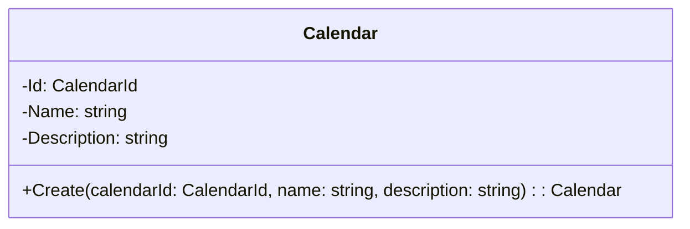

# Clase: Calendar

## Descripción

Un `Calendar` es una agrupación de `Appointment`s que pertenecen a una misma categoría.

### Responsabilidades

- Gestionar la creación y agrupación de citas.
- Validar la unicidad del `Calendar` dentro del sistema.
- Asegurar que los datos asociados (como `Name` y `Description`) cumplen con las restricciones de longitud y unicidad.

## Propiedades



- **Id**: Un `CalendarId` es el identificador único de un `Calendar`.
- **Name**: Nombre del calendario.
- **Description**: Descripción del calendario.

## Métodos

### Create (Instancia un nuevo calendario)

Crea un nuevo calendario con los parámetros proporcionados.

- **Parámetros**:
  - **calendarId** `CalendarId`: El identificador del calendario.
  - **name** `string`: El nombre del calendario.
  - **description** `string`: La descripción del calendario.
- **Valor de retorno**:
  - Un nuevo objeto `Calendar` con los parámetros proporcionados.
- **Eventos**:
  - `CalendarCreatedDomainEvent`: Se lanza cuando se crea un nuevo calendario.
- **Excepciones:**:
  - `DomainException` si el nombre no cumple con los requisitos de longitud.
  - `DomainException` si la descripción no cumple con los requisitos de longitud.

## Invariantes

- `Id` no pueden ser nulo.
- `Name` no puede ser nulo y debe cumplir una longitud de entre 1 y 50 caracteres.
- `Description` no puede ser nulo y debe tener entre 1 y 500 caracteres.

## Reglas de negocio

- El identificador del calendario debe ser único.
- El nombre del calendario debe ser único y debe tener entre 1 y 50 caracteres.
- La descripción del calendario debe tener entre 1 y 500 caracteres.
- No se puede eliminar un calendario si tiene alguna cita (Appointment) asociada.
- No se puede eliminar un calendario si tiene algún día festivo (CalendarHoliday) asociado.
- No se puede eliminar un calendario si tiene algún recurso (Resource) asignado.
- No se puede eliminar un calendario si tiene algún servicio (Service) asignado.
- No se puede eliminar un calendario si tiene algún horario de recurso (ResourceSchedule) asignado.

## Estado y Transiciones

## Dependencias

- **Entidades**:
- **Servicios**:
  - `ICalendarRepository`: Repositorio para interactuar con la base de datos.

- **Value Objects**:
  - `CalendarId`: Identificador único del calendario.

## Ejemplos

```csharp
// Crear un nuevo calendario a partir de un identificador único.
var calendar = Calendar.Create(
    CalendarId.From(Guid.Parse("7f2c1a3e-9b4d-4c8f-a45d-e8f1d2c3b4a5")),
    "Mi Calendario",
    "Este es mi calendario");

// Crear un nuevo calendario con un identificador único aleatorio.
var calendar = Calendar.Create(CalendarId.Create(), "Mi Calendario", "Este es mi calendario");
```
