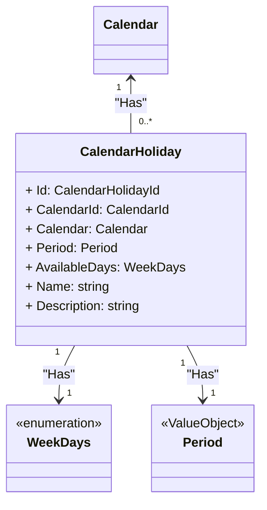

# Clase: CalendarHoliday

## Descripción

Un `CalendarHoliday` pertenece a un `Calendar` y tiene un `Period` que representa el rango de días festivos.

### Responsabilidades

- Representar un rango de días festivos dentro de un calendario.
- Asegurar que los datos asociados (como `Name` y `Description`) cumplen con las restricciones de longitud y unicidad.

## Propiedades

- **Id**: Un `CalendarHolidayId` es el identificador único de un `CalendarHoliday`.
- **CalendarId**: Un `CalendarId` es el identificador único de un `Calendar`.
- **Calendar**: Un `CalendarHoliday` pertenece a un [`Calendar`](./calendar.md).
- **Period**: Un `CalendarHoliday` tiene un `Period` que representa el rango de días festivos.
- **WeekDays**: Un `CalendarHoliday` tiene una enumeración de días de la semana disponibles.
- **Name**: Nombre del rango de días festivos.
- **Description**: Descripción del rango de días festivos.

## Métodos

### Create (Instancia de un nuevo rango de días festivos)

Crea un nuevo rango de días festivos con los parámetros proporcionados.

- **Parámetros:**:
  - **calendarHolidayId** `CalendarHolidayId`: El identificador del rango de días festivos.
  - **calendarId** `CalendarId`: El identificador del calendario al que pertenece el rango de días festivos.
  - **period** `Period`: El período que representa el rango de días festivos.
  - **availableDays** `WeekDays`: Los días de la semana disponibles en el rango de días festivos.
  - **name** `string`: El nombre del rango de días festivos.
  - **description** `string`: La descripción del rango de días festivos.
- **Valor de retorno:**:
  - Un nuevo objeto `CalendarHoliday` con los parámetros proporcionados.
- **Eventos:**:ç
  - `CalendarHolidayCreatedDomainEvent`: Evento que se dispara cuando se crea un nuevo rango de días festivos.
- **Excepciones:**:

## Invariantes

- `Id` no pueden ser nulo.
- `CalendarId` no puede ser nulo.
- `Period` no puede ser nulo.
- `AvailableDays` no puede ser nulo.
- `Name` no puede ser nulo y debe cumplir una longitud de entre 1 y 50 caracteres.
- `Description` no puede ser nulo y debe tener entre 1 y 500 caracteres.

## Reglas de negocio

Las reglas de negocio son las condiciones y lógicas que guían el comportamiento de la entidad. Por ejemplo:

- El `Id` debe ser único en toda la aplicación.
- `Name` debe ser único en toda la aplicación.

## Estado y Transiciones

Si la clase tiene diferentes estados o comportamientos dependiendo de ciertas condiciones, documenta esos estados y las transiciones permitidas.

Ejemplo:

- **Estado Inicial**: Descripción del estado inicial al crear un nuevo `Calendar`.

- **Estados Posibles**:
  - **Activo**: El `Calendar` está en uso y pueden crearse nuevas citas.
  - **Inactivo**: El `Calendar` no acepta nuevas citas, pero las citas existentes aún se muestran o mantienen.

- **Transiciones Permitidas**:
  - De **Activo** a **Inactivo**: Se realiza cuando el calendario se archiva o deja de estar disponible para nuevas citas.
  - De **Inactivo** a **Activo**: Se realiza cuando el calendario vuelve a estar disponible para aceptar nuevas citas.

- **Condiciones para Transiciones**:
  - Solo un administrador puede cambiar el estado de `Inactivo` a `Activo`.

## Dependencias

Lista de otras clases o servicios que la entidad depende. Esto puede incluir otros objetos de dominio o servicios de infraestructura.

- **Entidades**:
  - Lista de entidades utilizadas por esta clase.

- **Servicios**:
  - Lista de servicios utilizados por esta clase.

- **Value Objects**:
  - Lista de Value Objects utilizados por esta clase.

## Eventos

Listar aquí los eventos que la entidad puede emitir. Esto puede incluir eventos de dominio o eventos de infraestructura.

## Ejemplos

Proporciona ejemplos de cómo interactúa esta clase dentro del dominio, incluyendo cómo se crean instancias y se realizan cambios en sus propiedades. También incluye ejemplos de las reglas de negocio en acción.
