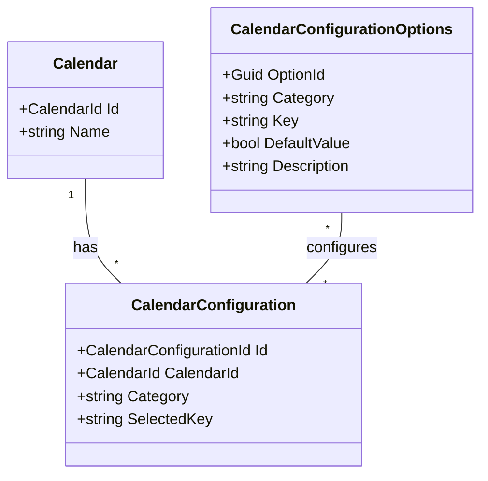

# User

- **Aggregate Root**: `CalendarConfiguration`
- **Namespace**: `AgendaManager.Domain.Calendars`
- **Tipo**: Entidad de Dominio Sellada (sealed)
- **Herencia**: `Entity`

## Descripción General

Esta entidad se utiliza para almacenar las configuraciones específicas de un calendario, como la estrategia de creación de citas, la estrategia de superposición de citas, la estrategia de creación de vacaciones, la zona horaria IANA, etc.

Estas configuraciones son específicas para cada calendario y pueden ser modificadas por el usuario.

Las opciones de cada configuración están definidas en la entidad `CalendarConfigurationOption`, que se utiliza para almacenar las opciones de configuración específicas de cada configuración.

### Responsabilidades

- **Creación de una nueva configuración**:
  - Añadir los valores por defecto de las opciones de configuración.
  - Los valores con una `Key` `UnitValue`, se deberá proporcionar un valor obtenido por un usuario.

- **Actualización de una configuración**:
  - Comprobar si la categoría de configuración existe en la base de datos `CalendarConfigurationOptions`.
  - Se deberán proporcionar la `Category` y `SelectedKey` de la configuración.
  - Se deberá comprobar si la `Category` y `SelectedKey` existen en la base de datos `CalendarConfigurationOptions`.
    - Si la `Category` tiene una `Key` `UnitValue`, no require de validación y siempre deberá ser un string.

- **Validación de valores UnitValue**:
  - Para configuraciones con `Key = 'UnitValue'`, validar que el valor proporcionado cumple con el formato esperado (ej: formato de zona horaria IANA).

- **Validación**:
  - Asegurarse de que el `Name` y `Description` cumplen con las restricciones de longitud.

## Invariantes

- `Id` no puede ser `null` en ningún momento y debe ser único en toda la aplicación.
- `CalendarId` no puede ser `null` en ningún momento.
- `CalendarId` y `Category` deben ser únicos en toda la aplicación.
- `Category` no puede ser nulo y debe tener entre 1 y 100 caracteres.
- `SelectedKey` no puede ser nulo y debe tener entre 1 y 100 caracteres.

## Reglas de negocio

- **Unicidad de Identificador**:
  - `Id` debe ser único en toda la aplicación.
  - `CalendarId` y `Category` deben ser únicos en toda la aplicación.

- **Validación de Valores**:
  - Los valores para configuraciones con `Key = 'UnitValue'` deben cumplir con el formato específico de cada categoría.
  - Para otras configuraciones, `SelectedKey` debe existir en `CalendarConfigurationOptions` para la categoría correspondiente.

## Propiedades

| Nombre        | Tipo                      | Descripción                                                     |
| ------------- | ------------------------- | --------------------------------------------------------------- |
| `Id`          | `CalendarConfigurationId` | Identificador único de la configuración.                        |
| `CalendarId`  | `CalendarId`              | Identificador del calendario al que pertenece la configuración. |
| `Calendar`    | `Calendar`                | Referencia al calendario al que pertenece la configuración.     |
| `Category`    | `string`                  | Categoría de la configuración.                                  |
| `SelectedKey` | `string`                  | Clave seleccionada de la configuración.                         |

## Métodos

### Create

```csharp
internal static CalendarConfiguration Create(
    CalendarConfigurationId id,
    CalendarId calendarId,
    string category,
    string selectedKey)
```

- **Descripción**: Crea una nueva configuración de calendario.
- **Parámetros**:
  - `id`: Identificador único de la configuración.
  - `calendarId`: Identificador del calendario al que pertenece la configuración.
  - `category`: Categoría de la configuración.
  - `selectedKey`: Clave seleccionada de la configuración.
- **Retorna**: Nueva instancia de `CalendarConfiguration`.

### Update

```csharp
internal bool Update(string category, string selectedKey)
```

- **Descripción**: Actualiza la configuración de calendario.
- **Parámetros**:
  - `category`: Categoría de la configuración.

### GuardAgainstInvalidCategory

```csharp
private void GuardAgainstInvalidCategory(string category)
```

- **Descripción**: Verifica que la categoría de la configuración sea válida.
- **Parámetros**:
  - `category`: Categoría de la configuración.
- **Excepciones**:
  - `CalendarConfigurationDomainException`: Si la categoría no es válida.

### GuardAgainstInvalidSelectedKey

```csharp
private void GuardAgainstInvalidSelectedKey(string selectedKey)
```

- **Descripción**: Verifica que la clave seleccionada de la configuración sea válida.
- **Parámetros**:
  - `selectedKey`: Clave seleccionada de la configuración.
- **Excepciones**:
  - `CalendarConfigurationDomainException`: Si la clave seleccionada no es válida.

### HasChanges

```csharp
private bool HasChanges(string category, string selectedKey)
```

- **Descripción**: Verifica si la configuración ha cambiado.
- **Parámetros**:
  - `category`: Categoría de la configuración.
  - `selectedKey`: Clave seleccionada de la configuración.
**Retorna**: `true` si la configuración ha cambiado, `false` en caso contrario.

## Estado y Transiciones

- **No Aplica**

## Dependencias

### Directas

- **Entidades Base**:
  - `AuditableEntity`: Base class que proporciona capacidades de auditoría
    - Hereda gestión de eventos de dominio (`Entity`)

### Interfaces

- `ICalendarConfigurationRepository`: Repositorio de configuraciones de calendario.

### Managers

- **No Aplica**

### Policies

- **No Aplica**

### Value Objects

- `CalendarConfigurationId`: Identificador único de la configuración.
- `CalendarId`: Identificador único del calendario.

## Comentarios adicionales

Esta es la representación de la tabla `CalendarConfigurationOptions` en la base de datos:

| OptionId                             | Category                       | Key                 | DefaultValue | Description           |
| ------------------------------------ | ------------------------------ | ------------------- | ------------ | --------------------- |
| 2a0c43ff-64ae-4797-b35b-4a50e3c429a1 | AppointmentCreationStrategy    | RequireConfirmation | false        | Require confirmation  |
| 2d32245d-3b77-492b-9de1-5229ba77046c | HolidayCreateStrategy          | RejectIfOverlapping | true         | Reject if overlapping |
| 6d93cf82-21f0-45bd-b427-2080f475c2c8 | AppointmentOverlappingStrategy | AllowOverlapping    | false        | Allow overlapping     |
| 7dccd558-3d0b-41ca-a92c-1b9327d6dd16 | HolidayCreateStrategy          | CancelOverlapping   | false        | Cancel overlapping    |
| ab89b7a9-1304-4c3a-ac3e-956b06fbef40 | AppointmentCreationStrategy    | Direct              | true         | Direct                |
| e024653b-7b4c-49a9-8385-4bb35710e895 | IanaTimeZone                   | UnitValue           | true         | Time zone             |
| eaea7f13-4f41-462e-a2a6-bffb3ee09757 | HolidayCreateStrategy          | AllowOverlapping    | false        | Allow overlapping     |
| febb98ae-280b-436e-8aa4-56b538bf8e76 | AppointmentOverlappingStrategy | RejectIfOverlapping | true         | Reject if overlapping |

Las configuraciones son transversales a todos los calendarios, por lo que se almacenan en la tabla `CalendarConfigurations`.

Esta tabla no tiene ninguna asociación con ninguna entidad en ninguna dirección.

- La `Category` es una cadena que se utiliza para agrupar las opciones de configuración.
- Una `Key` es una cadena que se utiliza para identificar la opción de configuración específica.
  - La `Key` con un valor `UnitValue` indica que la opción única dentro de la categoría, pro lo que solo habrá un único `Category` asociado al `Key`.
- La `DefaultValue` es un valor booleano que se utiliza para establecer el valor predeterminado de la opción de configuración.
- La `Description` es una cadena que se utiliza para describir la opción de configuración.

En este ejemplo, hay 4 categorías de opciones de configuración:

- **Categorías de configuración de citas**
  - `AppointmentCreationStrategy`
    - `RequireConfirmation`
    - `Direct`
  - `AppointmentOverlappingStrategy`
    - `AllowOverlapping`
    - `RejectIfOverlapping`
  - `HolidayCreateStrategy`
    - `RejectIfOverlapping`
    - `CancelOverlapping`
    - `AllowOverlapping`
  - `IanaTimeZone`
    - `UnitValue`: Este es un valor único, en este caso el valor se debe proporcionar por el usuario, ejemplo: `Europe/Madrid`.

---

Esta es una representación de la tabla `CalendarConfigurations` en la base de datos:

|Id                                   | CalendarId                           | Category                       | SelectedKey         |
|------------------------------------ | ------------------------------------ | ------------------------------ | ------------------- |
|2728eefe-7fab-4363-b9f9-6553aaf9cf35 | 6c8926c3-aed5-4ff5-960b-39def35143fc | AppointmentOverlappingStrategy | RejectIfOverlapping |
|3ab3370e-bfc7-4edf-8049-d99be824ced7 | 6c8926c3-aed5-4ff5-960b-39def35143fc | IanaTimeZone                   | Europe/Madrid       |
|ab7e15a4-2ef1-430f-b283-3daf3e4361ec | 6c8926c3-aed5-4ff5-960b-39def35143fc | AppointmentCreationStrategy    | Direct              |
|b23980da-5021-4e2f-8c0e-159e6477f47c | 6c8926c3-aed5-4ff5-960b-39def35143fc | HolidayCreateStrategy          | RejectIfOverlapping |

Estas son las configuraciones del calendario con el ID `6c8926c3-aed5-4ff5-960b-39def35143fc`, cada calendario existente, deberá tener una configuración de `CalendarConfigurationOptions.Category`.
En este caso, el calendario tiene 4 configuraciones:

- **Configuración de citas del calendario 6c8926c3-aed5-4ff5-960b-39def35143fc**
  - `AppointmentOverlappingStrategy`
    - `RejectIfOverlapping`
  -`IanaTimeZone`
    - `Europe/Madrid`
  - `AppointmentCreationStrategy`
    - `Direct`
  - `HolidayCreateStrategy`
    - `RejectIfOverlapping`

---

Para facilitar las configuraciones existentes, ver `CalendarConfigurationKeys`

---

### Añadir una nueva configuración

1. Añadir una nueva opción de configuración en la tabla `CalendarConfigurationOptions`

```sql
-- 1. Insertamos las nuevas opciones en CalendarConfigurationOptions
INSERT INTO CalendarConfigurationOptions
(OptionId, Category, "Key", DefaultValue, Description, CreatedAt, CreatedBy, LastModifiedAt, LastModifiedBy, Version)
VALUES
(gen_random_uuid(), 'DocumentStrategy', 'RequireSignature', 'false', 'Require document signature',
 CURRENT_TIMESTAMP, 'System', CURRENT_TIMESTAMP, 'System', 1),
(gen_random_uuid(), 'DocumentStrategy', 'AllowDownload', 'false', 'Allow document download',
 CURRENT_TIMESTAMP, 'System', CURRENT_TIMESTAMP, 'System', 1),
(gen_random_uuid(), 'DocumentStrategy', 'EnablePreview', 'true', 'Enable document preview',
 CURRENT_TIMESTAMP, 'System', CURRENT_TIMESTAMP, 'System', 1), -- Este es el valor por defecto
(gen_random_uuid(), 'DocumentStrategy', 'AllowSharing', 'false', 'Allow document sharing',
 CURRENT_TIMESTAMP, 'System', CURRENT_TIMESTAMP, 'System', 1);

-- 2. Por cada CalendarId, insertamos la opción que tiene DefaultValue = true
INSERT INTO CalendarConfiguration
(Id, CalendarId, Category, SelectedKey, CreatedAt, CreatedBy, LastModifiedAt, LastModifiedBy, Version)
SELECT
    gen_random_uuid() AS Id,
    c.Id AS CalendarId,
    'DocumentStrategy' AS Category,
    (SELECT "Key"
     FROM CalendarConfigurationOptions
     WHERE Category = 'DocumentStrategy'
     AND DefaultValue = 'true') AS SelectedKey,  -- Esto seleccionará 'EnablePreview'
    CURRENT_TIMESTAMP AS CreatedAt,
    'System' AS CreatedBy,
    CURRENT_TIMESTAMP AS LastModifiedAt,
    'System' AS LastModifiedBy,
    1 AS Version
FROM CalendarConfiguration c
WHERE c.CalendarId NOT IN (
    SELECT DISTINCT CalendarId
    FROM CalendarConfiguration
    WHERE Category = 'DocumentStrategy'
)
GROUP BY c.Id;
```

### Mantenibilidad

- Se recomienda mantener actualizados los valores en `CalendarConfigurationKeys` cada vez que se añada una nueva configuración.
- Considerar crear tests que validen que todos los calendarios tienen todas las configuraciones necesarias.
- Documentar el proceso de migración cuando se añaden nuevas configuraciones.

## Casos de Uso Comunes

1. **Creación de nuevo calendario**:
   - Se crean todas las configuraciones con sus valores por defecto
   - Para `UnitValue`, se requiere input del usuario

2. **Actualización de zona horaria**:
   - Ejemplo de actualización de configuración tipo `UnitValue`
   - Validación del formato IANA

3. **Cambio de estrategia de citas**:
   - Ejemplo de actualización entre opciones predefinidas
   - Validación contra valores permitidos

## Consideraciones de Rendimiento

- Las consultas de configuración son frecuentes en operaciones de calendario
- Considerar estrategias de caché para configuraciones frecuentemente accedidas
- Las validaciones contra `CalendarConfigurationOptions` deberían estar optimizadas

## Diagrama


