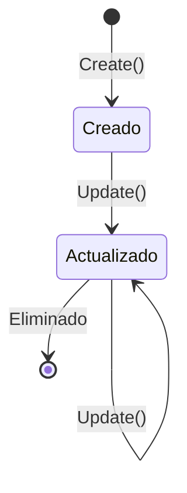

# CalendarSettings

- **Entity**: `CalendarSettings`
- **Namespace**: `{namespace}`
- **Tipo**: Entidad de Dominio Sellada (sealed)
- **Herencia**: `AuditableEntity`

## Descripción General

> Representa la configuración específica de un calendario en el sistema, gestionando aspectos críticos como la zona horaria y las estrategias de manejo de holidays (días festivos o no laborables). Esta entidad es fundamental para el correcto funcionamiento y la coherencia temporal de los calendarios en la aplicación.

## Responsabilidades

- **Gestión de Configuración del Calendario**:
  - Mantiene la configuración específica para cada calendario del sistema.
  - Garantiza la integridad y validez de los ajustes del calendario.
  - Gestiona la relación entre calendarios y sus configuraciones.

- **Configuración de la Zona Horaria**:
  - Establece y mantiene la zona horaria específica para cada calendario.
  - Asegura que todas las operaciones temporales del calendario respeten la zona horaria configurada.
  - Valida que la zona horaria especificada sea un identificador IANA válido.

- **Gestión de Estrategias para Holidays**:
  - Implementa políticas de manejo de conflictos para holidays.
  - Controla el comportamiento del sistema cuando hay solapamientos entre holidays y otros eventos.
  - Permite la flexibilidad en la gestión de conflictos mediante diferentes estrategias.

## Invariantes

- **Integridad de Identificadores**:
  - `Id` debe ser un `CalendarSettingsId` válido y no nulo.
  - `CalendarId` debe ser un `CalendarId` válido y no nulo.
  - La combinación de `Id` y `CalendarId` debe ser única en el sistema.

- **Validación de Zona Horaria**:
  - `IanaTimeZone` debe contener un identificador IANA válido.
  - No se permiten zonas horarias nulas o inválidas.

- **Estrategia de Holidays**:
  - `HolidayCreationStrategy` debe estar siempre definida y ser válida.
  - No se permite un valor nulo para la estrategia.

## Reglas de Negocio

- **Creación y Modificación**:
  - La creación de nuevas configuraciones solo se permite mediante el método factory `Create`.
  - Las modificaciones solo se realizan a través del método `Update`.
  - Se verifica la existencia de cambios reales antes de aplicar actualizaciones.

- **Gestión de Eventos de Dominio**:
  - Se notifica la creación mediante `CalendarSettingsCreatedDomainEvent`.
  - Las modificaciones significativas generan eventos de dominio apropiados.

- **Estrategias de Manejo de Holidays**:

  ```csharp
  public enum HolidayCreationStrategy
  {
      RejectIfOverlapping,    // Rechaza nuevos holidays si hay conflictos
      CancelOverlapping,      // Cancela eventos existentes para dar prioridad al holiday
      AllowOverlapping        // Permite la coexistencia de holidays y otros eventos
  }
  ```

## Propiedades

| Propiedad                 | Tipo                      | Acceso       | Descripción                                                          |
|--------------------------|---------------------------|--------------|----------------------------------------------------------------------|
| `Id`                     | `CalendarSettingsId`      | get         | Identificador único de la configuración. Inmutable tras creación.     |
| `CalendarId`             | `CalendarId`              | get/private set | Identificador del calendario asociado. Inmutable tras creación.   |
| `Calendar`               | `Calendar`                | get/private set | Navegación a la entidad Calendar asociada.                         |
| `IanaTimeZone`           | `IanaTimeZone`            | get/private set | Zona horaria del calendario. Modificable vía Update.              |
| `HolidayCreationStrategy`| `HolidayCreationStrategy` | get/private set | Estrategia de gestión de holidays. Modificable vía Update.        |

## Métodos

### Create

```csharp
internal static CalendarSettings Create(
    CalendarSettingsId id,
    CalendarId calendarId,
    IanaTimeZone ianaTimeZone,
    HolidayCreationStrategy holidayCreationStrategy)
```

- **Propósito**: Factory method para crear nuevas instancias de configuración.
- **Validaciones**:
  - Verifica que ningún parámetro sea nulo
  - Valida la coherencia de los identificadores
- **Eventos**: Emite `CalendarSettingsCreatedDomainEvent`
- **Retorno**: Nueva instancia válida de `CalendarSettings`

### Update

```csharp
internal void Update(
    IanaTimeZone ianaTimeZone,
    HolidayCreationStrategy holidayCreationStrategy)
```

- **Propósito**: Actualiza la configuración existente
- **Optimización**: Solo realiza cambios si detecta diferencias reales
- **Validaciones**: Verifica la validez de los nuevos valores
- **Efectos**: Actualiza `IanaTimeZone` y `HolidayCreationStrategy` si hay cambios

### HasChanges

```csharp
internal bool HasChanges(
    IanaTimeZone ianaTimeZone,
    HolidayCreationStrategy holidayCreationStrategy)
```

- **Propósito**: Determina si los nuevos valores representan un cambio real
- **Lógica**: Compara valores actuales con propuestos
- **Retorno**: `true` si hay al menos un cambio, `false` en caso contrario

## Estado y Transiciones



## Dependencias

### Directas

- **Entidades Base**:
  - `AuditableEntity`: Base class que proporciona capacidades de auditoría

### Value Objects

- `CalendarSettingsId`: Identificador de la configuración
- `CalendarId`: Identificador del calendario
- `IanaTimeZone`: Representa una zona horaria válida
- `HolidayCreationStrategy`: Enum de estrategias disponibles

### Eventos de Dominio

- `CalendarSettingsCreatedDomainEvent`: Notifica la creación
- `CalendarSettingsUpdatedDomainEvent`: Notifica cambios significativos

## Ejemplos de Uso

```csharp
// Creación de nueva configuración
var settings = CalendarSettings.Create(
    new CalendarSettingsId(Guid.NewGuid()),
    existingCalendarId,
    new IanaTimeZone("Europe/Madrid"),
    HolidayCreationStrategy.RejectIfOverlapping);

// Actualización de configuración
settings.Update(
    new IanaTimeZone("Europe/London"),
    HolidayCreationStrategy.CancelOverlapping);

// Verificación de cambios
bool hasChanges = settings.HasChanges(
    currentTimeZone,
    newStrategy);
```

## Consideraciones de Diseño

- **Inmutabilidad Parcial**: Los identificadores son inmutables tras la creación
- **Encapsulamiento**: Constructores privados y propiedades con setters protegidos
- **Validación**: Verificaciones exhaustivas en puntos de entrada
- **Optimización**: Evita actualizaciones innecesarias mediante `HasChanges`

## Buenas Prácticas Implementadas

1. **Domain-Driven Design (DDD)**:
   - Encapsulamiento fuerte
   - Invariantes de dominio protegidos
   - Eventos de dominio para cambios significativos

2. **Clean Code**:
   - Métodos con responsabilidad única
   - Nombres descriptivos y significativos
   - Validaciones explícitas

3. **Seguridad**:
   - Validación de nulos
   - Protección contra modificaciones no autorizadas
   - Control de acceso mediante modificadores internal

## Notas de Implementación

- La entidad está marcada como `sealed` para prevenir herencia no deseada
- Los setters privados protegen la integridad de los datos
- Los métodos internos permiten control desde el mismo assembly
- Se utiliza el patrón Factory para la creación de instancias
