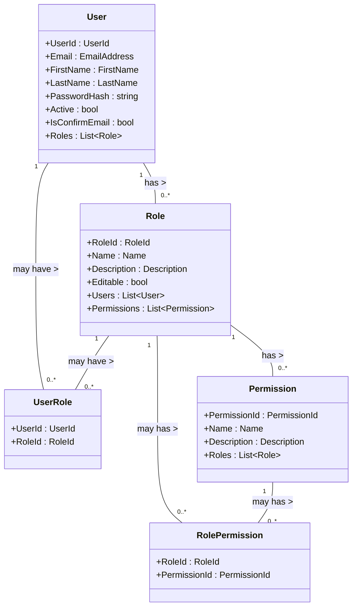

# Authorization

## Descripción



```csharp
public class UserConfigurations : IEntityTypeConfiguration<User>
{
    public void Configure(EntityTypeBuilder<User> builder)
    {
        builder.HasKey(u => u.UserId);

        builder.Property(u => u.Email).IsRequired();
        builder.Property(u => u.FirstName).IsRequired();
        builder.Property(u => u.LastName).IsRequired();
        builder.Property(u => u.PasswordHash).IsRequired();
        builder.Property(u => u.Active);
        builder.Property(u => u.IsConfirmEmail);

        builder.HasMany(u => u.Roles)
            .WithMany(r => r.Users)
            .UsingEntity<UserRole>(
                j => j.HasOne<Role>().WithMany().HasForeignKey(ur => ur.RoleId),
                j => j.HasOne<User>().WithMany().HasForeignKey(ur => ur.UserId),
                j =>
                {
                    j.ToTable("UserRoles");
                    j.HasKey(t => new { t.UserId, t.RoleId });
                });

        builder.OwnsMany<Role>("Roles", rb =>
        {
            rb.ToTable("Roles");
            rb.WithOwner().HasForeignKey("UserId");
            rb.Property(r => r.Name).IsRequired();
            rb.Property(r => r.Description);
            rb.Property(r => r.Editable);

            rb.HasMany(r => r.Permissions)
                .WithMany(p => p.Roles)
                .UsingEntity<RolePermission>(
                    j => j.HasOne<Permission>().WithMany().HasForeignKey(rp => rp.PermissionId),
                    j => j.HasOne<Role>().WithMany().HasForeignKey(rp => rp.RoleId),
                    j =>
                    {
                        j.ToTable("RolePermissions");
                        j.HasKey(t => new { t.RoleId, t.PermissionId });
                    });
        });

        builder.OwnsMany<Permission>("Permissions", pb =>
        {
            pb.ToTable("Permissions");
            // ... otras configuraciones de Permission ...
        });
    }
}
```
