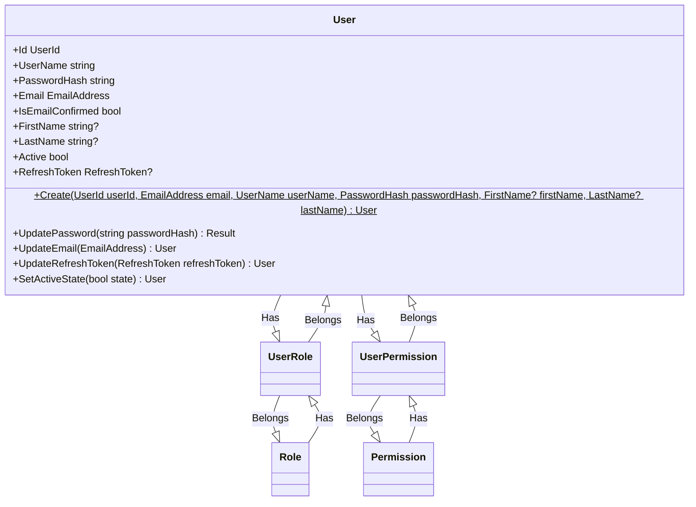
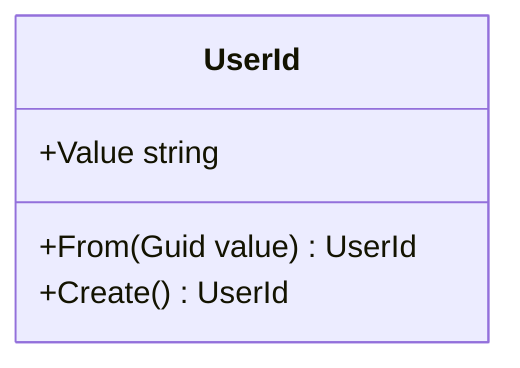
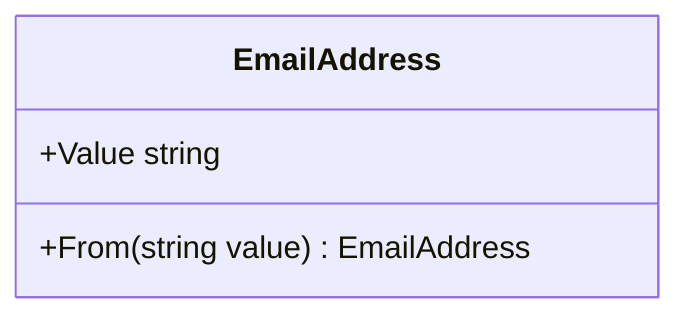
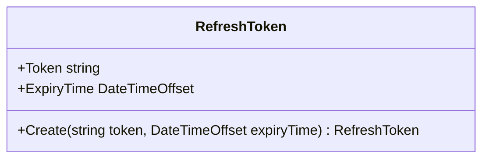

# User

- **UserRole**: Asociación de roles a usuarios.
- **Role**: Representa un rol que puede tener un usuario.
- **UserPermission**: Asociación de permisos a usuarios.
- **Permission**: Representa un permiso específico que puede tener un usuario.

## Reglas de negocio

- La contraseña debe tener al menos 8 caracteres y contener al menos una letra mayúscula, una minúscula, un número y un carácter especial.
- El campo `Active` debe reflejar el estado actual del usuario, permitiendo su activación o desactivación solo por administradores legítimos.
- El correo electrónico debe ser valido y único.

## Domain Events

- `UserCreatedDomainEvent(UserId userId)` Se lanza cuando se crea un nuevo usuario.
- `UserUpdatedDomainEvent(UserId userId)` Se lanza cuando se actualiza la información básica de un usuario.
- `UserPasswordUpdatedDomainEvent(UserId userId)` Se lanza cuando se actualiza la contraseña de un usuario.
- `UserEmailUpdatedDomainEvent(UserId userId)` Se lanza cuando se actualiza el correo electrónico de un usuario.
- `UserEmailConfirmedDomainEvent(UserId userId)` Se lanza cuando se confirma el correo electrónico de un usuario.
- `UserActiveStateChangedDomainEvent(UserId UserId, bool State)` Se lanza cuando cambia el estado activo de un usuario.

## Value objects

- `UserId` Identificador único del usuario.
- `EmailAddress` Dirección de correo electrónico del usuario.
- `RefreshToken` Es un token utilizado para mantener la autenticación del usuario entre sesiones.

### UserId

Representa el identificador único de un usuario.

### EmailAddress

Representa una dirección de correo electrónico válida.

### RefreshToken

Es un token utilizado para mantener la autenticación del usuario entre sesiones.

## Documentación Adicional
