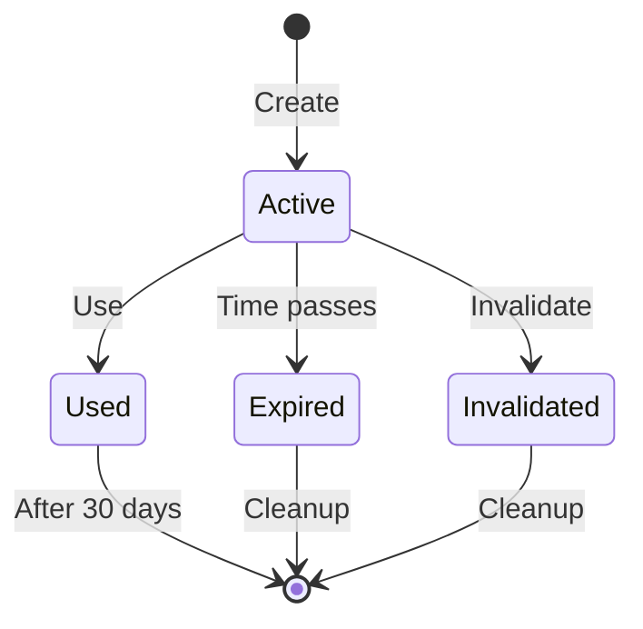

Tu borrador es un buen punto de partida. Te propongo algunas mejoras y adiciones para hacerlo más completo:

# class: UserToken

## Descripción

Una clase `UserToken` representa un token de seguridad temporal asociado a un usuario para operaciones que requieren verificación adicional, como la confirmación de email o el restablecimiento de contraseña. Esta entidad forma parte del agregado `User`.

### Responsabilidades

- **Gestión del Ciclo de Vida del Token**:
  - Crear tokens seguros y únicos
  - Gestionar la expiración de tokens
  - Invalidar tokens después de su uso
  - Limpiar tokens expirados

- **Validación y Seguridad**:
  - Validar la autenticidad de los tokens
  - Asegurar que los tokens solo se usen una vez
  - Prevenir uso concurrente de tokens
  - Validar el tipo correcto de token para cada operación

- **Eventos de Dominio**:
  - `UserTokenCreated`: Cuando se genera un nuevo token
  - `UserTokenUsed`: Cuando el token se utiliza exitosamente
  - `UserTokenExpired`: Cuando el token expira
  - `UserTokenInvalidated`: Cuando el token se invalida manualmente

## Propiedades

| Propiedad           | Tipo                      | Descripción                                                |
|---------------------|---------------------------|------------------------------------------------------------|
| `Id`                | `UserTokenId`             | Identificador único del token                              |
| `UserId`            | `UserId`                  | Identificador del usuario asociado                         |
| `Token`             | `Token`                   | Valor del token (cryptográficamente seguro)                |
| `UserTokenType`     | `UserTokenType`           | Propósito del token                                        |
| `ExpiryDate`        | `DateTimeOffset`          | Fecha de expiración                                        |
| `CreatedAt`         | `DateTimeOffset`          | Fecha de creación                                          |
| `UsedAt`            | `DateTimeOffset?`         | Fecha de uso (null si no ha sido usado)                    |
| `IsUsed`            | `bool`                    | Indica si el token ya fue utilizado                        |

## Métodos

### Constructores

```
Create(UserId userId, UserTokenType type) : UserToken
```

- Genera un nuevo token con valores por defecto
- Asigna una fecha de expiración basada en el tipo de token
- Emite evento `UserTokenCreated`

### Públicos

```
Validate() : bool
```

- Verifica que el token:
  - No haya expirado
  - No haya sido usado
  - Sea del tipo correcto
- Retorna true si el token es válido

```
Use() : void
```

- Marca el token como usado
- Registra la fecha de uso
- Emite evento `UserTokenUsed`
- Lanza excepción si el token ya fue usado

```
Invalidate(string reason) : void
```

- Invalida manualmente el token
- Emite evento `UserTokenInvalidated`

## Invariantes

- Un token debe tener un valor único en el sistema
- La fecha de expiración debe ser posterior a la fecha de creación
- Un token usado no puede volver a usarse
- Un token no puede modificarse después de ser usado
- Solo puede existir un token activo por tipo por usuario

## Reglas de negocio

### Generación de Tokens

- Los tokens deben ser cryptográficamente seguros
- La longitud mínima del token debe ser de 32 caracteres
- Cada tipo de token tiene un tiempo de expiración específico:
  - `EmailVerification`: 24 horas
  - `PasswordReset`: 1 hora

### Validación

- Un token expirado no puede ser usado
- Un token usado no puede ser reutilizado
- Al usar un token incorrecto más de 3 veces, se deben bloquear intentos por 15 minutos

### Limpieza

- Los tokens expirados deben ser eliminados automáticamente
- Los tokens usados deben ser eliminados después de 30 días

## Estado y Transiciones



## Eventos de Dominio

1. `UserTokenCreated`
   - Cuando: Al crear un nuevo token
   - Datos: TokenId, UserId, Type, ExpiryDate

2. `UserTokenUsed`
   - Cuando: Al usar exitosamente el token
   - Datos: TokenId, UserId, UsedAt

3. `UserTokenExpired`
   - Cuando: Al detectar que un token ha expirado
   - Datos: TokenId, UserId, ExpiryDate

4. `UserTokenInvalidated`
   - Cuando: Al invalidar manualmente un token
   - Datos: TokenId, UserId, Reason

## Consideraciones de Implementación

### Seguridad

- Usar algoritmos cryptográficamente seguros para generación de tokens
- Implementar rate limiting para prevenir ataques de fuerza bruta
- Almacenar solo hashes de tokens, nunca valores en texto plano
- Implementar protección contra timing attacks

### Rendimiento

- Indexar campos frecuentemente consultados
- Implementar limpieza periódica de tokens expirados
- Considerar caché para validaciones frecuentes

### Concurrencia

- Implementar bloqueo optimista para prevenir condiciones de carrera
- Manejar intentos concurrentes de uso del mismo token

¿Te gustaría que profundice en algún aspecto específico o que agreguemos alguna otra sección?
