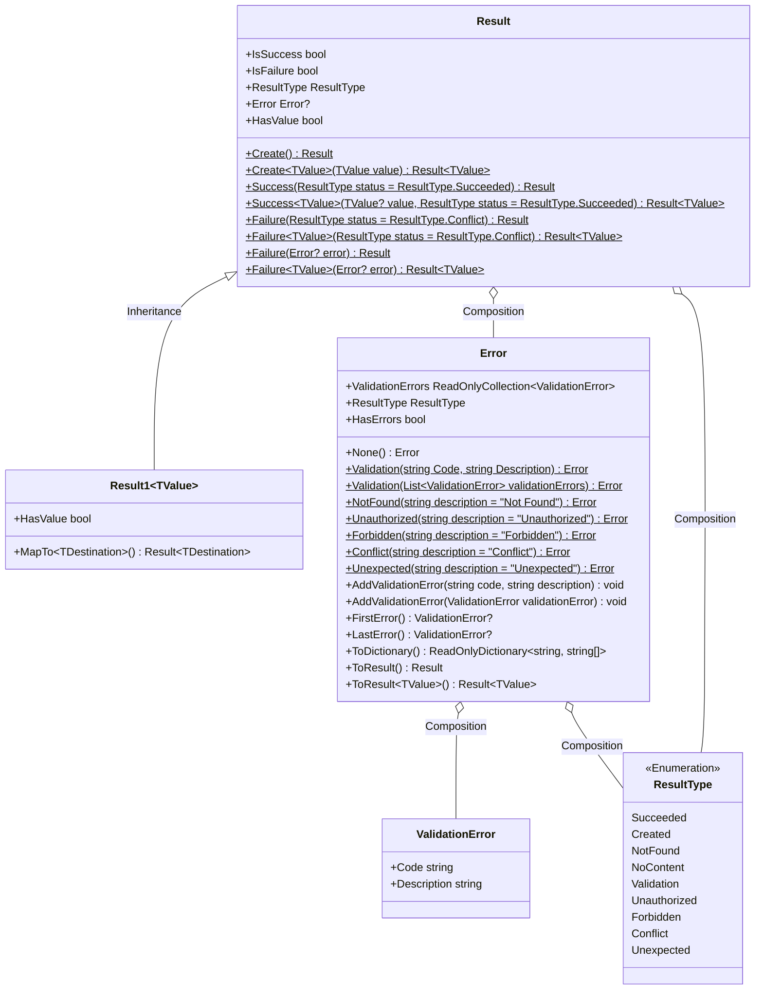

# Result

```mermaid
classDiagram
    class Result {
        +IsSuccess bool
        +IsFailure bool
        +ResultType ResultType
        +Error Error?
        +HasValue bool

        +Create() Result$
        +Create~TValue~(TValue value) Result~TValue~$
        +Success(ResultType status = ResultType.Succeeded) Result$
        +Success~TValue~(TValue? value, ResultType status = ResultType.Succeeded) Result~TValue~$
        +Failure(ResultType status = ResultType.Conflict) Result$
        +Failure~TValue~(ResultType status = ResultType.Conflict) Result~TValue~$
        +Failure(Error? error) Result$
        +Failure~TValue~(Error? error) Result~TValue~$

    }

    class Result1~TValue~ {
        +HasValue bool

        +MapTo~TDestination~() Result~TDestination~
    }

    Result <|-- Result1~TValue~ : Inheritance

    class Error {
        +ValidationErrors ReadOnlyCollection~ValidationError~
        +ResultType ResultType
        +HasErrors bool

        +None() Error
        +Validation(string Code, string Description) Error$
        +Validation(List~ValidationError~ validationErrors) Error$
        +NotFound(string description = "Not Found") Error$
        +Unauthorized(string description = "Unauthorized") Error$
        +Forbidden(string description = "Forbidden") Error$
        +Conflict(string description = "Conflict") Error$
        +Unexpected(string description = "Unexpected") Error$
        +AddValidationError(string code, string description) void
        +AddValidationError(ValidationError validationError) void
        +FirstError() ValidationError?
        +LastError()  ValidationError?
        +ToDictionary() ReadOnlyDictionary~string, string[]~
        +ToResult() Result
        +ToResult~TValue~() Result~TValue~
    }

    Result o-- Error : Composition

    class ValidationError {
        +Code string
        +Description string
    }

    Error o-- ValidationError : Composition

    class ResultType {
        <<Enumeration>>
        Succeeded
        Created
        NotFound
        NoContent
        Validation
        Unauthorized
        Forbidden
        Conflict
        Unexpected
    }

    Result o-- ResultType : Composition
    Error o-- ResultType : Composition
```
