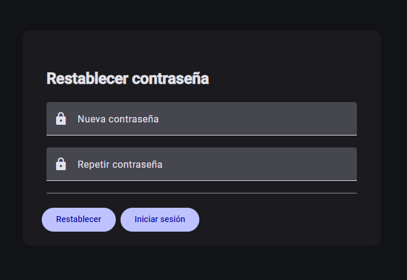
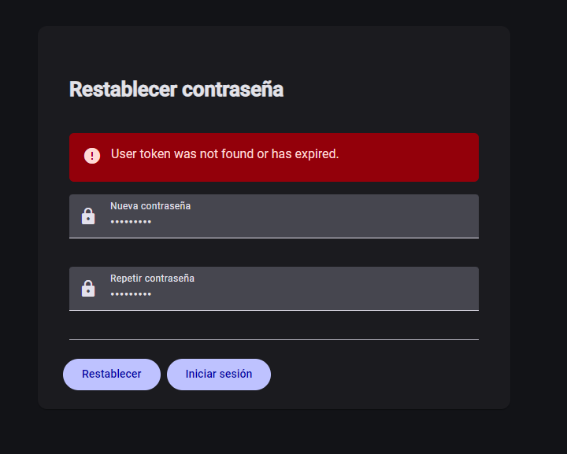

# Caso de Uso: Confirmar Recuperación de Contraseña

## Objetivo

Permitir a los usuarios confirmar su contraseña si la han olvidado.

## Actores

- Usuario no autenticado

## Flujo Principal

1. El usuario accede a la página de recuperación de contraseña desde el correo electrónico
2. El sistema muestra el formulario con:
   - Campo para insertar la nueva contraseña
   - Campo para confirmar la nueva contraseña
   - Botón "Restablecer"
   - Botón con enlace a "Inicia Sesión"
3. El usuario introduce la nueva contraseña
4. El sistema valida la nueva contraseña
5. El sistema notifica al usuario de que la contraseña ha sido cambiada en caso de éxito

## Flujos Alternativos

### Credenciales Inválidas

- El sistema muestra mensaje de error: "Token inválido o expirado"

## Validaciones

- El token debe ser un token válido y no expirado
- Verifica que la contraseña cumple con las reglas de seguridad

## Mockups

## Notas Técnicas

- Ruta: `/accounts/confirm-recovery-password`
- API Endpoint: `POST /api/v1/accounts/confirm-recovery-password`
- Muestra un toast de éxito y redirige a la página de login en caso de éxito

## Criterios de Aceptación

- [x] El formulario valida campos antes de enviar
- [x] Se muestran mensajes de error apropiados
- [x] Se redirige correctamente tras validación del token
- [x] El botón de restableces se deshabilita durante el proceso
