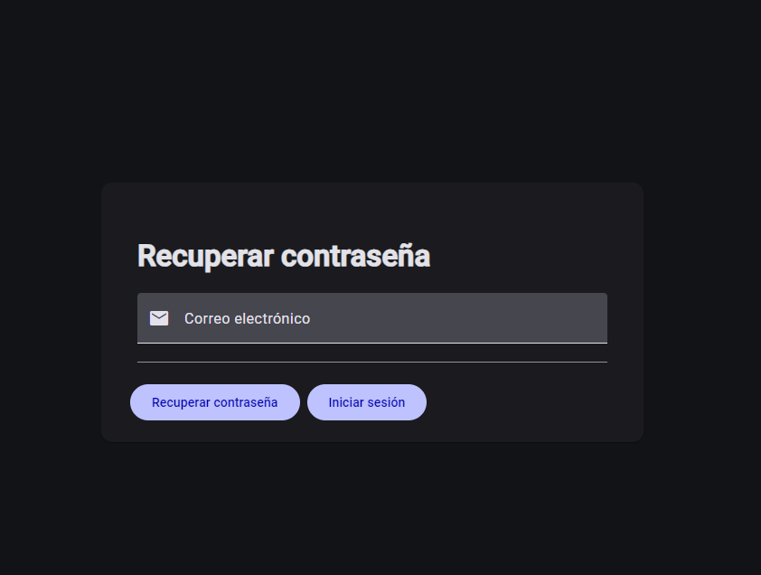
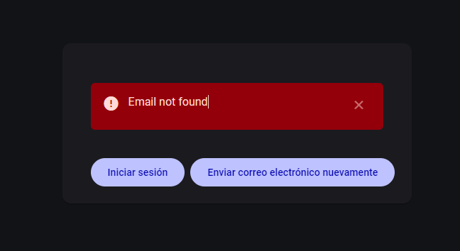
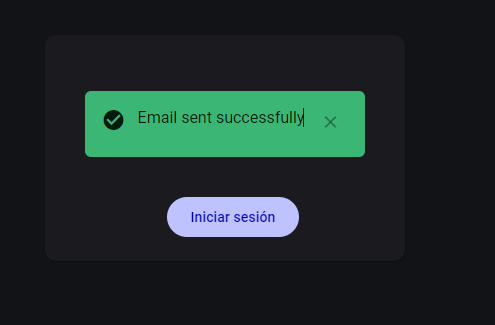

# Caso de Uso: Recuperación de Contraseña

## ToDo List

- [ ] Mejorar diseño de la página
- [ ] Mensajes del sistema en español

## Objetivo

Permitir a los usuarios recuperar su contraseña si la han olvidado.

## Actores

- Usuario no autenticado

## Flujo Principal

1. El usuario accede a la página de recuperación de contraseña
2. El sistema muestra el formulario con:
   - Campo para email
   - Botón "Recuperar Contraseña"
   - Botón con enlace a "Inicia Sesión"
3. El usuario introduce su email
4. El sistema valida el email
5. El sistema notifica al usuario de que se ha enviado un correo electrónico con un enlace para recuperar la contraseña
6. El sistema envía un correo electrónico con un enlace para recuperar la contraseña

## Flujos Alternativos

### Credenciales Inválidas

- El sistema muestra mensaje de error: "Email no encontrado"

### Usuario Bloqueado

- El sistema muestra mensaje: "Tu cuenta está bloqueada. Contacta con soporte"
- Se proporciona enlace al formulario de contacto

### Usuario pendiente de confirmación

- El sistema muestra mensaje: "Tu cuenta no está confirmada. Revisa tu correo"

## Validaciones

- El email debe ser un email válido
- Verifica que el email existe en la base de datos
- Verifica que el usuario no está bloqueado
- Verifica que el usuario no está pendiente de confirmación

## Mockups

## Notas Técnicas

- Ruta: `/accounts/recovery-password`
- API Endpoint: `POST /api/v1/accounts/recovery-password`
- Muestra un mensaje e de éxito o error

## Criterios de Aceptación

- [x] El formulario valida campos antes de enviar
- [x] Se muestran mensajes de error o éxito apropiados
- [x] El botón de recuperación se deshabilita durante el proceso
